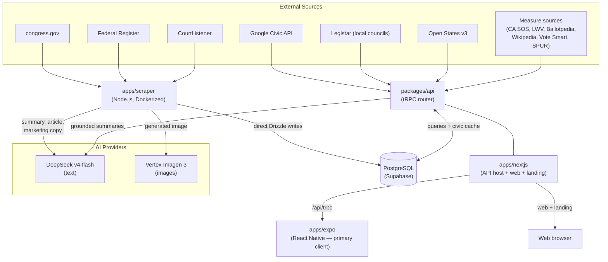
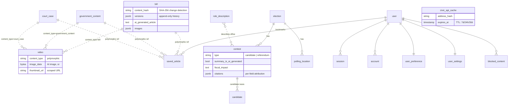
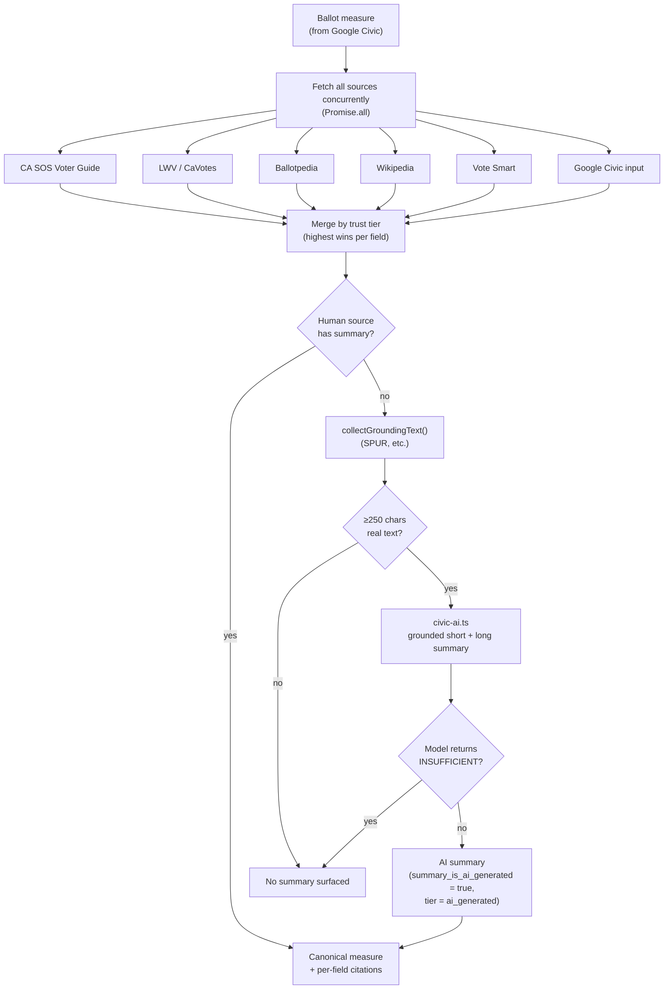
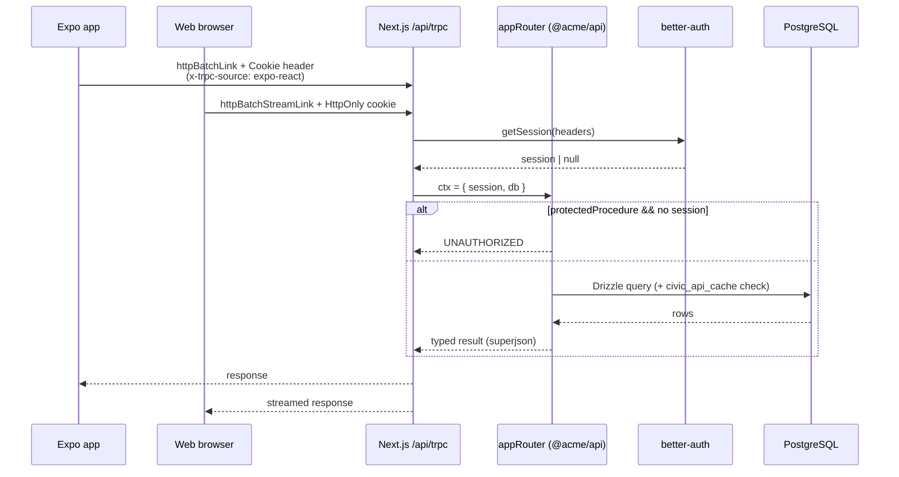
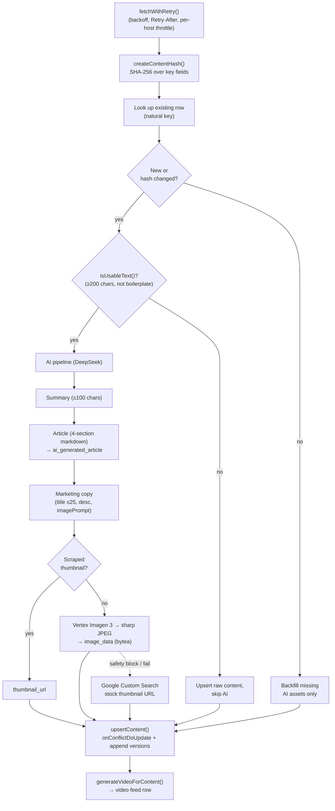

# Architecture

Billion is an AI-powered civic information app. It pulls from government and civic data sources (Congress, the Federal Register, the Supreme Court, local councils, and election authorities), enriches the content with AI-generated articles, summaries, and imagery, cross-validates ballot-measure information against official records, and surfaces all of it to users through a React Native mobile app backed by a Next.js + tRPC API.

This document covers how the system is structured, why the key decisions were made, and what alternatives were considered. See [CONTRIBUTING.md](./CONTRIBUTING.md) for dev setup, styling conventions, and localtunnel configuration. See [docs/MEASURE_ENRICHMENT.md](./docs/MEASURE_ENRICHMENT.md) for the deep dive on ballot-measure cross-validation.

### System Overview



---

## Monorepo Structure

```
apps/
  expo/        React Native app (Expo SDK 53, React 19) — primary client
  nextjs/      Next.js 16 web app + tRPC API host + marketing page
  scraper/     Standalone Node.js data pipeline (Dockerized)
packages/
  api/         tRPC router definitions + civic data integrations + AI grounding
  auth/        better-auth configuration (web cookies + Expo deep-link bridge)
  db/          Drizzle schema, migrations, lazy client
  ui/          Shared Radix/shadcn components + theme tokens (web + native)
  validators/  Shared Zod schemas (placeholder — drizzle-zod covers most needs)
tooling/
  eslint/      Shared ESLint presets (base / nextjs / react)
  tailwind/    Shared Tailwind v4 theme (OKLCH tokens) + PostCSS config
  typescript/  Shared tsconfig bases
  prettier/    Shared Prettier config (import-sort + tailwind plugins)
  github/      Reusable CI setup action
social-media-agent/   Instagram posting automation (Playwright + Gemini)
```

The monorepo is managed with **pnpm workspaces** and **Turborepo**. Internal packages are named `@acme/*` and are not published to npm. Versions are aligned via the pnpm **catalog** in `pnpm-workspace.yaml`. Requires Node `>=22.20.0` and pnpm `>=10.15.1`.

This was bootstrapped from [create-t3-turbo](https://github.com/t3-oss/create-t3-turbo) — that template supplied the Next.js + tRPC + Drizzle + Expo + better-auth skeleton; everything civic-specific (scrapers, the civic API surface, measure cross-validation, the AI pipeline) was built on top.

---

## Data Layer

### Why Drizzle ORM

We use [Drizzle ORM](https://orm.drizzle.team/) over a **PostgreSQL** backend hosted on **Supabase** (connection string points at `pooler.supabase.com:6543`).

Drizzle was chosen because:

- **Schema-as-code with full type inference.** Every query's TypeScript type is derived from the schema definition — no codegen, no type drift. Change a column and TypeScript immediately flags every affected callsite.
- **Thin abstraction.** Drizzle stays close to SQL; there's no opaque query builder hiding what's sent to the database.
- **drizzle-zod integration.** Insert schemas (`createInsertSchema`) are derived directly from table definitions, keeping validation in sync with the DB.

**Why not the Supabase client directly?** Supabase's PostgREST JS client generates relatively loose types (`Json` for JSONB, unions that don't reflect actual data shapes, no inference across joins). With a non-trivial schema — polymorphic references, typed JSONB columns, per-field citation arrays — Drizzle's precise inferred types matter. Using Supabase as the Postgres *host* is fine; using its client as the *ORM* loses too much type fidelity.

### DB Client

`packages/db/src/client.ts` exports a lazy-initialized `db` singleton via a `Proxy`. The Drizzle connection (`drizzle-orm/node-postgres`, native `pg` driver, `snake_case` casing) isn't created until the first query, so importing the package never opens a connection on its own.

Because the driver opens a raw TCP socket via Node's `net`/`tls`, **only server-side code can use the DB client directly.** The mobile app's JS runtime has no socket layer (see [Frontend Apps](#frontend-apps)).

Migrations use `drizzle-kit`. `drizzle.config.ts` strips the pooler port `:6543` down to direct `:5432` for migrations, since DDL doesn't play well with the transaction pooler. Run via `pnpm -F @acme/db push` (or `db:push` from the root); inspect with `db:studio`.

### Schema Overview

The schema (`packages/db/src/schema.ts` + better-auth-generated `auth-schema.ts`) has ~20 tables in five groups.

**Government content** — the scraped source material:

| Table                | Purpose                                                       |
| -------------------- | ------------------------------------------------------------ |
| `bill`               | Congressional legislation (congress.gov)                     |
| `government_content` | Presidential documents — EOs, proclamations, memoranda, notices (Federal Register) |
| `court_case`         | SCOTUS & federal court opinions (CourtListener)              |
| `post`              | Legacy sample-post table from the T3 template                |

All three content tables share a common pattern:

- `content_hash` (SHA-256 over key fields) — detects changes between scrape runs to avoid redundant AI generation
- `versions` (JSONB array) — append-only `{ hash, updatedAt, changes }` log
- `ai_generated_article` — AI-enriched markdown stored on the row
- `images` (JSONB array) — `{ url, alt, source, sourceUrl }[]`
- `thumbnail_url` — primary display image

**Feed layer:**

| Table   | Purpose                                                                 |
| ------- | ----------------------------------------------------------------------- |
| `video` | Derived feed cards — one row per content item via a polymorphic `(content_type, content_id)` ref. Holds AI marketing copy (title ≤25 chars, ~50-word description) and either a JPEG in `image_data` (`bytea`) or a scraped `thumbnail_url`. `engagement_metrics` JSONB. |

**Civic / elections** — the voter-information model:

| Table              | Purpose                                                                              |
| ------------------ | ------------------------------------------------------------------------------------ |
| `election`         | Election records (external id, date, type, OCD division, deadlines JSONB)            |
| `contest`          | Races *and* ballot measures. `type` = candidate \| referendum. For measures: `referendum_title`, pro/con statements, `summary`, `summary_is_ai_generated`, `fiscal_impact`, and a `citations` JSONB array (per-field source attribution: field, source name/url, trust tier, official flag) |
| `candidate`        | Candidates within a contest (party, incumbent, contact, bio)                         |
| `polling_location` | Polling places / early-vote sites / drop boxes, geo-located (lat/long), with hours   |
| `role_description` | Reusable descriptions of offices/roles by level (seeded with ~18 federal→local roles) |

**Local government (Legistar cache)** — `legistar_body`, `legistar_matter`, `legistar_meeting`, `legistar_agenda_item`, `legistar_vote`. These cache San Jose / Santa Clara / Sunnyvale council data (ordinances, meetings, agenda items, votes) keyed by `(jurisdiction, *_id)` with a `fetched_at` timestamp.

**User engagement & caching:**

| Table             | Purpose                                                              |
| ----------------- | ------------------------------------------------------------------- |
| `saved_article`   | Bookmarks — polymorphic `(content_type, content_id)` per user        |
| `user_preference` | Preferred topics / content types (JSONB string arrays)              |
| `blocked_content` | Hidden sources/topics                                               |
| `user_settings`   | Privacy & consent flags (location, personalize, analytics, crash, offline) |
| `civic_api_cache` | Google Civic responses, keyed by `(address_hash, endpoint, params)` with `expires_at` TTL |

**Auth** — better-auth-managed `user`, `session`, `account`, `verification` (regenerated into `auth-schema.ts` via `pnpm auth:generate`).

### Key Relationships

The content tables feed the `video` table and are referenced by `saved_article` through the same polymorphic `(content_type, content_id)` pair — neither uses a foreign key, so the dashed links below denote polymorphic refs, not enforced constraints.



---

## API Layer

### Why tRPC

The API is a [tRPC v11](https://trpc.io/) router in `packages/api/`, served by Next.js at `/api/trpc`. Because mobile can't reach the database directly, tRPC is the typed RPC layer the phone calls over HTTP.

- **End-to-end type safety, no schema file.** Router input/output types flow straight to both the Next.js server and the Expo client — no OpenAPI spec, no codegen, no drift.
- **One package, all clients.** Both `apps/expo` and `apps/nextjs` import `@acme/api` and get identical type-safe procedures.

`superjson` is the transformer. `protectedProcedure` throws `UNAUTHORIZED` when `ctx.session?.user` is null; the session comes from `@acme/auth`'s `getSession({ headers })` in the tRPC context.

### Router Structure

The root router (`packages/api/src/root.ts`) composes **eight** sub-routers:

| Router       | Procedures (Q = query, M = mutation, 🔒 = protected)                                                                 |
| ------------ | -------------------------------------------------------------------------------------------------------------------- |
| `auth`       | `getSession` (Q), `getSecretMessage` (Q 🔒)                                                                           |
| `civic`      | `getElections`, `getVoterInfo`, `getRepresentatives`, `getRepresentativesEnriched` (all Q) — Google Civic           |
| `legistar`   | `getLocalBills`, `getMeetings`, `getAgenda`, `getVotes`, `getBodies`, `getMeetingVotes` (all Q) — local councils     |
| `openStates` | `searchBills`, `getBillDetails`, `getLegislators`, `getBillVotes` (all Q) — CA state legislature (Open States v3)    |
| `content`    | `getAll`, `getByType`, `getById` (all Q) — aggregates bill / government_content / court_case                         |
| `video`      | `getInfinite` (Q) — cursor-paginated feed; converts `bytea` images to data URIs                                      |
| `post`       | `all`, `byId` (Q); `create`, `delete` (M 🔒)                                                                          |
| `user`       | preferences, blocked content, settings, profile, and saved-article CRUD (all 🔒)                                     |

### Civic Data & External Sources

The `civic` router calls the **Google Civic Information API** (`GOOGLE_CIVIC_API_KEY`). Responses are cached in the `civic_api_cache` table, keyed by a SHA-256 of the (lower-cased) address plus endpoint and params, with per-endpoint TTLs — elections 7d, voter info 24h, representatives 30d. When the key is absent it returns realistic mock data so dev/demo still works. `getVoterInfo` retries without a stale `electionId` if Google rejects it ("Election unknown").

Other live civic integrations:

- **`legistar`** — scrapes Legistar instances for San Jose, Santa Clara County, and Sunnyvale (no key required).
- **`openStates`** — California bills, legislators, and votes via the Open States v3 API (`OPEN_STATES_API_KEY`).

### Ballot-Measure Cross-Validation

Google Civic returns measure *titles* but rarely the summary, fiscal impact, pro/con arguments, or full text — especially for local measures. `civic.getVoterInfo` runs each measure through a **cross-validation engine** (`packages/api/src/lib/measure-crossvalidate.ts`) that fetches from multiple public-record sources concurrently and merges them **by trust tier** (highest wins per field):

```
county_registrar > state_sos > lwv > ballotpedia > wikipedia > vote_smart > google_civic > ai_generated
```

Source adapters live in `packages/api/src/lib/measure-sources/`:

| Source                          | Adapter                | Scope                                              | Method            |
| ------------------------------- | ---------------------- | -------------------------------------------------- | ----------------- |
| CA SOS Official Voter Guide     | `ca-sos-voterguide.ts` | CA statewide propositions (summary + LAO fiscal + pro/con) | HTML scrape       |
| League of Women Voters (CaVotes)| `cavotes.ts`           | CA statewide propositions (summary, pro/con)       | WordPress REST    |
| Ballotpedia                     | `ballotpedia.ts`       | Statewide **and** local lettered measures          | HTML scrape       |
| Wikipedia                       | `wikipedia.ts`         | CA statewide propositions (intro only)             | MediaWiki API     |
| Vote Smart                      | (`votesmart.ts`)       | State-level measures (pro/con argument URLs)        | REST (`VOTE_SMART_API_KEY`) |
| Google Civic                    | (the input itself)     | Whatever the API returned                          | —                 |

When no human source supplies a summary, the engine falls back to AI — but **AI never authors from a bare title.** `grounded-fallback.ts` first collects real source text (e.g. the SPUR voter guide), and only then does `civic-ai.ts` produce short (1-sentence) and long (3-4 sentence) summaries, plus pro/con arguments, *grounded strictly in that fetched text*. The prompt returns an `INSUFFICIENT` sentinel and the result is discarded if the grounding text doesn't actually describe the measure. AI output is flagged (`summary_is_ai_generated`) and cited (tier `ai_generated`) so the UI can label it.

**Principles:** official sources win field conflicts; every surfaced field carries a citation; AI structures and reconciles but never invents. Results ride along in the cached `civic_api_cache` voter-info response (24h TTL).



### LLM Provider (API side)

`packages/api/src/lib/ai-provider.ts` exports a single swappable `llm` via the Vercel AI SDK: **DeepSeek `deepseek-v4-flash`** when `DEEPSEEK_API_KEY` is set, falling back to OpenAI `gpt-4o-mini` when only `OPENAI_API_KEY` is present, and `null` otherwise. Callers treat `null` as "AI unavailable" and skip generation rather than throw.

### Why Next.js as the Single API Host

Next.js (port 3000) serves the web frontend, hosts the tRPC API at `/api/trpc`, and serves the marketing/landing page — one deployment, deployed to Vercel. The Expo app points at this same server. This keeps a single better-auth implementation (cookies for web, header pass-through for mobile), one thing to deploy for API + web + landing, and the database never exposed outside the server process. Next.js is the most widely adopted React framework with first-class Vercel deploys, which the project leans on for zero-config previews and production.

### Request Path

Both clients call the same router; only the auth transport differs — web rides an HttpOnly cookie, mobile injects the session as a `Cookie` header.



---

## Scraper Pipeline

### Overview

`apps/scraper/` is a standalone Node.js process. It runs on demand or on a schedule and writes **directly to the database** via `@acme/db` — no HTTP, no tRPC, no auth. It's a trusted server-side process; routing writes through tRPC would add latency, require tokens, and force write endpoints to be secured for no benefit.

Invoke via CLI: `pnpm start [federalregister|congress|scotus|vote411|all] [--concurrency N]` (default concurrency 3, via `p-limit`). It ships as a multi-stage `Dockerfile.scraper` (Node 20-slim) that builds `@acme/db` + the scraper, rewrites package exports to `dist/`, and runs `node dist/main.js`.

### Scrapers

| Scraper            | Source                              | Content type         | Method                       |
| ------------------ | ----------------------------------- | -------------------- | ---------------------------- |
| `congress.ts`      | congress.gov REST API               | `bill`               | REST (`CONGRESS_API_KEY`), incremental by `updateDate` |
| `federalregister.ts` | federalregister.gov REST API      | `government_content` | REST; HTML→Markdown via Turndown |
| `scotus.ts`        | CourtListener REST API              | `court_case`         | REST (`COURTLISTENER_API_KEY`, optional) |
| `vote411.ts`       | vote411.org                         | (cached locally)     | cheerio HTML parse; does **not** write to the main DB |

All HTTP goes through one `fetchWithRetry()` utility (`apps/scraper/src/utils/fetch.ts`): exponential backoff (1s/2s/4s…), `Retry-After` support (seconds or HTTP-date), 30s default timeout via `AbortController`, retriable on 429/5xx and `ECONNRESET`/`ECONNREFUSED`, plus a stateful **per-host backoff** that ramps on 429/5xx and relaxes on success.

> Note: `whitehouse.gov` cheerio scraping was replaced by the structured **Federal Register** REST API. `vote411-ballot.ts` exists for address-based ballot lookup (needs Playwright) but isn't wired into the CLI.

### Upsert + Change Detection

`apps/scraper/src/utils/db/operations.ts` centralizes writes behind a discriminated-union `upsertContent(type, data)` (`type` ∈ bill | government_content | court_case). Each run:

1. Compute a SHA-256 over the type-specific key fields (title, summary, full text, status…).
2. Look up the existing row by its natural key (`(billNumber, sourceWebsite)`, `url`, or `caseNumber`).
3. **Unchanged hash** → skip AI entirely; backfill only missing AI assets.
4. **New or changed** → run the AI pipeline, upsert via `onConflictDoUpdate`, append to `versions`.

`SCRAPER_FORCE_AI_REGEN=1` overrides the cache. A `isUsableText()` gate refuses to feed AI any text under 200 chars or that's mostly blank/all-caps/single-word lines — keeps the model from "summarizing" garbage.

### AI Pipeline

Provider config lives in `apps/scraper/src/utils/ai/provider.ts`: text via **DeepSeek `deepseek-v4-flash`** (Vercel AI SDK), images via **Google Vertex AI Imagen 3**. Token and image costs are tracked per run.

Each new/changed item runs through:

1. **Summary** (`text-generation.ts`) — ≤100-char punchy summary, 8th-grade reading level.
2. **Article** (`text-generation.ts`) — structured 4-section markdown: *What This Means For You*, *Overview*, *Impact & Implications*, *The Debate*; balanced across perspectives. Stored in `ai_generated_article`. Throws a typed `AIRateLimitError` on 429.
3. **Marketing copy** (`marketing-generation.ts`) — Zod-validated `{ title ≤25 chars, description ≤25 words, imagePrompt }` for the `video` feed card.
4. **Imagery** — two paths:
   - *Scraped thumbnail* (preferred, free): source-provided image URL → `thumbnail_url`.
   - *Generated*: Imagen 3 produces a 1024×1024 image from the marketing image prompt; `sharp` converts PNG→JPEG (q85); bytes land in the `image_data` `bytea` column. Up to 3 retries with backoff; safety-filter blocks return `null` silently.
   - *Stock-photo fallback*: `image-keywords.ts` → Google Custom Search (`GOOGLE_API_KEY` + `GOOGLE_SEARCH_ENGINE_ID`) can supply a thumbnail URL.

> The earlier design used **Gemini for text and DALL-E for images**; both were replaced (DeepSeek for cost/quality on text, Vertex Imagen for images).

### Pipeline Flow

The SHA-256 gate is the main cost control: unchanged content skips every AI call.



---

## Frontend Apps

### Expo (Mobile) — primary client

**Expo SDK 53, React 19, Expo Router 5.** It talks to the backend **exclusively over the tRPC HTTP API** — no direct DB access.

**Why mobile can't hit the DB directly:**
1. **No TCP socket in React Native.** Drizzle's `pg` driver needs Node's `net`/`tls` to open a Postgres connection; RN's runtime has no socket layer.
2. **Security.** A connection string in an app binary is extractable → unrestricted DB access for anyone.

A PostgREST-style HTTP API (Supabase anon key + RLS) would solve both, but our business logic and auth live in the tRPC layer, so we keep the DB server-side and reach it via RPC.

**tRPC client** (`apps/expo/src/utils/api.tsx`) uses `httpBatchLink`. The base URL (`utils/base-url.ts`) prefers `EXPO_PUBLIC_API_URL`, else auto-detects the dev machine's IP from the Expo debugger host, else `localhost:3000`. Requests carry `x-trpc-source: expo-react` and the auth cookie.

**Screens** (Expo Router): four tabs — Browse (`index`, content + search + an election banner for the signed-in user's own election), Feed (`feed`, swipeable video cards), Elections (`elections`, address-based voter info), Settings. Detail routes include `article-detail`, `contest-detail`, `measure-detail`, and `local-elections`. The measure-detail screen renders the short summary on the card and the long summary on detail, the `summaryIsAiGenerated` label, structured pro/con arguments, fiscal impact, and per-field source citations linking back to origin.

**Styling:** NativeWind v5. All Expo styles are consolidated in `apps/expo/src/styles.ts`, which re-exports shared tokens from `@acme/ui/theme-tokens` and adds RN-specific layers (`planes` for surface depth, `hair` hairline borders, content-type colors) plus the `sp`/`rd` rem-to-px helpers and a `useTheme()` hook. Brand fonts (IBM Plex Serif, Inria Serif, Albert Sans) load via `expo-font`. See CONTRIBUTING.md for the full style API.

### Next.js (Web)

**Next.js 16, React 19, App Router.** Serves the marketing/landing page (hero, privacy, terms) and hosts the tRPC API. The route handler is `apps/nextjs/src/app/api/trpc/[trpc]/route.ts` (`fetchRequestHandler` over `appRouter`, with the server-side `auth` instance and CORS). RSC prefetch + `HydrateClient` on the server (`trpc/server.tsx`); the client (`trpc/react.tsx`) uses `httpBatchStreamLink`. In production it deploys to Vercel; in dev the Expo app tunnels to it via localtunnel (see CONTRIBUTING.md).

### Shared UI

`packages/ui/` provides Radix-based, shadcn-style web components (button, input, field, label, separator, dropdown-menu, toast via Sonner) plus React Native variants (`button-native`, `card-native`) and the cross-platform `theme-tokens.ts` (colors, dark/light themes — dark is default — font sizes, weights, shadows). Add components with `pnpm ui-add`.

### Auth (cross-platform)

better-auth (`packages/auth/`, `initAuth()`): Drizzle/Postgres adapter, Discord OAuth (when configured), `oAuthProxy`, and a custom **`expoPlugin`** that bridges OAuth/magic-link callbacks back to the native app. The plugin mirrors the `expo-origin` header to `origin` for better-auth's origin check and appends the set-cookie into deep-link params so the native client can store the session.

- **Web** — better-auth sets an HttpOnly cookie; fetch sends it automatically.
- **Mobile** — `@better-auth/expo` stores the session locally and the tRPC link injects it as a `Cookie` header; trusted origin `expo://`.

---

## Build & Tooling

- **Turborepo** (`turbo.json`) defines `build` / `dev` / `lint` / `format` / `typecheck` / `push` / `studio` pipelines with caching where safe. `globalEnv` declares every secret the build is allowed to see — `POSTGRES_URL`, the auth secrets, all the civic/government API keys, and the AI provider keys (`DEEPSEEK_API_KEY`, `OPENAI_API_KEY`).
- **pnpm catalog** pins shared versions (tRPC 11.16, React 19, Drizzle 0.45, better-auth 1.5.6, Zod 4, Tailwind 4, TypeScript 6); `overrides` apply security patches and pin the Expo Metro stack.
- **tooling/** packages share ESLint presets (`base`/`nextjs`/`react`), the Tailwind v4 **OKLCH** design-token theme (`theme.css`: navy-base dark-first palette, Civic Blue accent, content-type colors, brand fonts), tsconfig bases, and Prettier config.
- **CI** (`.github/workflows/ci.yml`): lint (+ `sherif` workspace lint), format check, typecheck, and an Expo iOS/Android export, all on a shared `tooling/github/setup` action with Turbo remote caching.
- **Deployment:** Next.js → Vercel; scraper → `Dockerfile.scraper`; Expo release flow via `Justfile` (`bump` / `build` / `release`) and `scripts/bump.mjs`.

`packages/validators/` is currently a placeholder — most validation is handled by drizzle-zod, with this package reserved for future cross-platform schemas. `social-media-agent/` is a separate Playwright + Gemini tool that automates Instagram posts for the app.

---

## Considered Alternatives

| Decision          | What we chose          | What we considered        | Why we didn't                                                                                          |
| ----------------- | ---------------------- | ------------------------- | ------------------------------------------------------------------------------------------------------ |
| ORM               | Drizzle                | Supabase client, Prisma   | Supabase types are too loose; Prisma needs codegen and adds overhead                                   |
| API protocol      | tRPC                   | REST, GraphQL             | REST needs manual type upkeep; GraphQL is heavy for this scale                                          |
| Mobile DB access  | tRPC over HTTP         | Supabase PostgREST + RLS  | Would force migrating auth + business logic out of the API layer                                       |
| AI text model     | DeepSeek v4-flash      | Gemini, GPT-4o            | Cost/quality ratio; swappable via the Vercel AI SDK (OpenAI is the configured fallback)               |
| AI image model    | Vertex Imagen 3        | DALL-E 3                  | Migrated off DALL-E; Imagen integrates via the same Vertex/AI-SDK tooling                              |
| Measure summaries | Cross-validate sources, AI only as grounded last resort | AI-generate everything | Official records must win; AI is barred from authoring on a bare title (hallucination risk)            |
| Image storage     | `bytea` in Postgres    | S3/R2 object storage      | Simpler for now; object storage is the right move at scale                                              |
| Scraper DB access | Direct Drizzle         | tRPC mutations            | No benefit to HTTP overhead for a trusted server process                                                |
| Scraper framework | Custom fetch + cheerio | Crawlee                   | Crawlee pulled in Playwright + Apify storage for a pattern that's ~60 lines of fetch+retry; the REST-API scrapers didn't need it at all |
| Gov-content source| Federal Register API   | whitehouse.gov scraping   | Structured REST beats fragile HTML scraping for presidential documents                                  |
