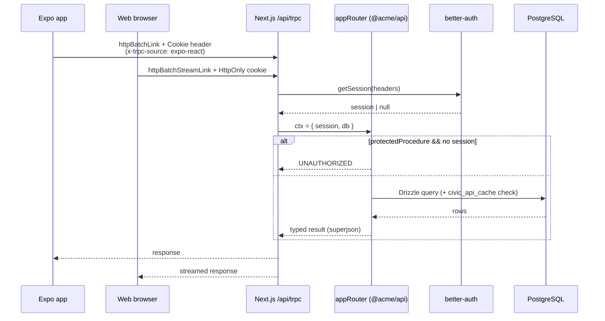

# API Layer

## Why tRPC

The API is a [tRPC v11](https://trpc.io/) router in `packages/api/`, served by Next.js at `/api/trpc`. Because mobile can't reach the database directly, tRPC is the typed RPC layer the phone calls over HTTP.

- **End-to-end type safety, no schema file.** Router input/output types flow straight to both the Next.js server and the Expo client — no OpenAPI spec, no codegen, no drift.
- **One package, all clients.** Both `apps/expo` and `apps/nextjs` import `@acme/api` and get identical type-safe procedures.

`superjson` is the transformer. `protectedProcedure` throws `UNAUTHORIZED` when `ctx.session?.user` is null; the session comes from `@acme/auth`'s `getSession({ headers })` in the tRPC context.

## Router Structure

The root router (`packages/api/src/root.ts`) composes **nine** sub-routers:

| Router       | Procedures (Q = query, M = mutation, 🔒 = protected)                                                                                                                                  |
| ------------ | ------------------------------------------------------------------------------------------------------------------------------------------------------------------------------------- |
| `auth`       | `getSession` (Q), `getSecretMessage` (Q 🔒)                                                                                                                                           |
| `civic`      | `getElections`, `getVoterInfo`, `getTexasCurrentElection`, `getRepresentatives`, `getRepresentativesEnriched` (all Q) — Google Civic + official current-cycle Texas data + enrichment |
| `places`     | `autocomplete` (Q), `details` (M) — Google Places address autocomplete for the ballot lookup                                                                                          |
| `legistar`   | `getLocalBills`, `getMeetings`, `getAgenda`, `getVotes`, `getBodies`, `getMeetingVotes` (all Q) — local councils                                                                      |
| `openStates` | `searchBills`, `getBillDetails`, `getLegislators`, `getBillVotes` (all Q) — CA state legislature (Open States v3)                                                                     |
| `content`    | `getAll`, `getByType`, `getById` (all Q) — aggregates bill / government_content / court_case                                                                                          |
| `video`      | `getInfinite` (Q) — cursor-paginated feed; converts `bytea` images to data URIs                                                                                                       |
| `post`       | `all`, `byId` (Q); `create`, `delete` (M 🔒)                                                                                                                                          |
| `user`       | preferences, blocked content, settings, profile, and saved-article CRUD (all 🔒)                                                                                                      |

## Civic Data & External Sources

The `civic` router calls the **Google Civic Information API** (`GOOGLE_CIVIC_API_KEY`). Responses are cached in the `civic_api_cache` table, keyed by a SHA-256 of the (lower-cased) address plus endpoint and params, with per-endpoint TTLs — elections 7d, voter info 24h, representatives 30d. When the key is absent it returns realistic mock data so dev/demo still works. `getVoterInfo` retries without a stale `electionId` if Google rejects it ("Election unknown").

Other live civic integrations:

- **`legistar`** — scrapes Legistar instances for San Jose, Santa Clara County, and Sunnyvale (no key required).
- **`localGovernment`** — reads persisted provider-neutral meetings. `listMeetings` returns bounded meeting summaries and official links; `getMeeting` returns agenda items, actions, attachments, and named votes without live source calls.
- **`openStates`** — California bills, legislators, and votes via the Open States v3 API (`OPEN_STATES_API_KEY`).
- **`places`** — Google **Places Autocomplete (New)** for the ballot address entry (`packages/api/src/lib/places.ts`). `autocomplete` returns US street-address predictions (biased `includedRegionCodes: ["us"]`, `includedPrimaryTypes: street_address/premise/subpremise`) for queries ≥3 chars; `details` resolves a `placeId` to its full `formattedAddress` (the ZIP the prediction omits, which Civic wants). A **session token** (UUID stable across one address entry) bundles all keystroke calls plus the closing `details` into a single billed unit. Reuses `GOOGLE_PLACES_API_KEY` → `GOOGLE_API_KEY` → `GOOGLE_CIVIC_API_KEY`; with no key it serves a small mock list so the dropdown still works in dev (same fallback pattern as `civic`).

Ballot measures and candidates returned by `getVoterInfo` are run through cross-validation engines that merge multiple public-record sources by trust tier — see [Ballot-measure enrichment](./measure-enrichment.md) and [Candidate enrichment](./candidate-enrichment.md). Key/access setup for every source is in [Civic data source setup](./civic-data-sources.md).

`civic.getTexasCurrentElection` is an input-free reader over persisted current
Texas SOS/TLC snapshots. It returns current statewide/federal/district
candidates and results plus the latest constitutional-amendment analyses. SOS
facts and TLC explanation are separately cited. Historical election browsing is
intentionally not part of this procedure; see
[Texas current-election data](./texas-current-election.md).

## LLM Provider

`packages/api/src/lib/ai-provider.ts` exports a single swappable `llm` via the Vercel AI SDK: **Groq** when `GROQ_API_KEY` is set, then **OpenRouter** when `OPENROUTER_API_KEY` is present (using `OPENROUTER_MODEL`, default `deepseek/deepseek-v4-flash`), then **OpenAI `gpt-4o-mini`**, then deprecated direct **DeepSeek `deepseek-v4-flash`** during migration, and `null` otherwise. Callers treat `null` as "AI unavailable" and skip generation rather than throw.

## Why Next.js as the Single API Host

Next.js (port 3000) serves the web frontend, hosts the tRPC API at `/api/trpc`, and serves the marketing/landing page — one deployment, deployed to Vercel. The Expo app points at this same server. This keeps a single better-auth implementation (cookies for web, header pass-through for mobile), one thing to deploy for API + web + landing, and the database never exposed outside the server process. Next.js is the most widely adopted React framework with first-class Vercel deploys, which the project leans on for zero-config previews and production.

## Request Path

Both clients call the same router; only the auth transport differs — web rides an HttpOnly cookie, mobile injects the session as a `Cookie` header.

