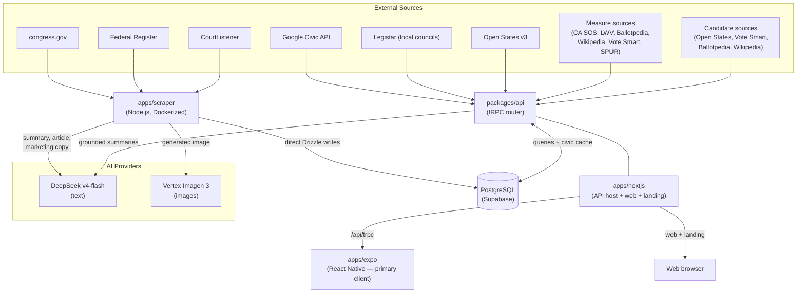

# Architecture

Billion is an AI-powered civic information app. It pulls from government and civic data sources (Congress, the Federal Register, the Supreme Court, local councils, and election authorities), enriches the content with AI-generated articles, summaries, and imagery, cross-validates ballot-measure **and candidate** information against official and public-record sources, and surfaces all of it to users through a React Native mobile app backed by a Next.js + tRPC API.

This document is the big picture; the rest of the [docs folder](./README.md) covers each subsystem in detail:

- [Data layer](./data-layer.md) — Drizzle, the schema, migrations
- [API layer](./api.md) — the tRPC router and civic integrations
- [Ballot-measure enrichment](./measure-enrichment.md) and [candidate enrichment](./candidate-enrichment.md) — the cross-validation engines
- [Scraper pipeline](./scraper.md) — the content ingestion pipeline
- [Frontend apps](./frontend.md) — Expo, Next.js, shared UI, auth
- [Civic data source setup](./civic-data-sources.md) — keys/access per source

See [CONTRIBUTING.md](../CONTRIBUTING.md) for dev setup.

## System Overview



## Monorepo Structure

```
apps/
  expo/        React Native app (Expo SDK 53, React 19) — primary client
  nextjs/      Next.js 16 web app + tRPC API host + marketing page
  scraper/     Standalone Node.js data pipeline (Dockerized)
packages/
  api/         tRPC router definitions + civic data integrations + AI grounding
  auth/        better-auth configuration (web cookies + Expo deep-link bridge)
  db/          Drizzle schema, migrations, lazy client
  ui/          Shared Radix/shadcn components + theme tokens (web + native)
  validators/  Shared Zod schemas (placeholder — drizzle-zod covers most needs)
tooling/
  eslint/      Shared ESLint presets (base / nextjs / react)
  tailwind/    Shared Tailwind v4 theme (OKLCH tokens) + PostCSS config
  typescript/  Shared tsconfig bases
  prettier/    Shared Prettier config (import-sort + tailwind plugins)
  github/      Reusable CI setup action
```

The monorepo is managed with **pnpm workspaces** and **Turborepo**. Internal packages are named `@acme/*` and are not published to npm. Versions are aligned via the pnpm **catalog** in `pnpm-workspace.yaml`. Requires Node `>=22.20.0` and pnpm `>=10.15.1`.

This was bootstrapped from [create-t3-turbo](https://github.com/t3-oss/create-t3-turbo) — that template supplied the Next.js + tRPC + Drizzle + Expo + better-auth skeleton; everything civic-specific (scrapers, the civic API surface, measure cross-validation, the AI pipeline) was built on top.

## Build & Tooling

- **Turborepo** (`turbo.json`) defines `build` / `dev` / `lint` / `format` / `typecheck` / `push` / `studio` pipelines with caching where safe. `globalEnv` declares every secret the build is allowed to see — `POSTGRES_URL`, the auth secrets, all the civic/government API keys, and the AI provider keys (`DEEPSEEK_API_KEY`, `OPENAI_API_KEY`).
- **pnpm catalog** pins shared versions (tRPC 11.16, React 19, Drizzle 0.45, better-auth 1.5.6, Zod 4, Tailwind 4, TypeScript 6); `overrides` apply security patches and pin the Expo Metro stack.
- **tooling/** packages share ESLint presets (`base`/`nextjs`/`react`), the Tailwind v4 **OKLCH** design-token theme (`theme.css`: navy-base dark-first palette, Civic Blue accent, content-type colors, brand fonts), tsconfig bases, and Prettier config.
- **CI** (`.github/workflows/ci.yml`): lint (+ `sherif` workspace lint), format check, typecheck, and an Expo iOS/Android export, all on a shared `tooling/github/setup` action with Turbo remote caching.
- **Deployment:** Next.js → Vercel; scraper → `Dockerfile.scraper`; Expo release flow via `Justfile` (`bump` / `build` / `release`) and `scripts/bump.mjs` — see [iOS release builds](./ios-release.md).

`packages/validators/` is currently a placeholder — most validation is handled by drizzle-zod, with this package reserved for future cross-platform schemas.

## Considered Alternatives

| Decision           | What we chose                                                                                      | What we considered                    | Why we didn't                                                                                                                           |
| ------------------ | -------------------------------------------------------------------------------------------------- | ------------------------------------- | --------------------------------------------------------------------------------------------------------------------------------------- |
| ORM                | Drizzle                                                                                            | Supabase client, Prisma               | Supabase types are too loose; Prisma needs codegen and adds overhead                                                                    |
| API protocol       | tRPC                                                                                               | REST, GraphQL                         | REST needs manual type upkeep; GraphQL is heavy for this scale                                                                          |
| Mobile DB access   | tRPC over HTTP                                                                                     | Supabase PostgREST + RLS              | Would force migrating auth + business logic out of the API layer                                                                        |
| AI text model      | Groq-hosted model (then DeepSeek v4-flash, then GPT-4o mini)                                        | Gemini, GPT-4o                        | Cost/quality ratio; swappable via the Vercel AI SDK (Groq is the configured default, with DeepSeek and OpenAI fallbacks)               |
| AI image model     | Vertex Imagen 3                                                                                    | DALL-E 3                              | Migrated off DALL-E; Imagen integrates via the same Vertex/AI-SDK tooling                                                               |
| Measure summaries  | Cross-validate sources, AI only as grounded last resort                                            | AI-generate everything                | Official records must win; AI is barred from authoring on a bare title (hallucination risk)                                             |
| Candidate bios     | Source-supplied only (Open States / Vote Smart / Ballotpedia / Wikipedia), cross-validated by tier | AI-author bios from name              | A bio is a factual record about a real person; AI authoring on a bare name risks fabrication — show sparse UI instead                   |
| Candidate storage  | Cache-only in `civic_api_cache` (`candidate-enrich`, 7d)                                           | Persist to `candidate`/`contest` rows | On-demand per voter address; durable rows add write paths and staleness for data that recomputes cheaply                                |
| Image storage      | `bytea` in Postgres                                                                                | S3/R2 object storage                  | Simpler for now; object storage is the right move at scale                                                                              |
| Scraper DB access  | Direct Drizzle                                                                                     | tRPC mutations                        | No benefit to HTTP overhead for a trusted server process                                                                                |
| Scraper framework  | Custom fetch + cheerio                                                                             | Crawlee                               | Crawlee pulled in Playwright + Apify storage for a pattern that's ~60 lines of fetch+retry; the REST-API scrapers didn't need it at all |
| Gov-content source | Federal Register API                                                                               | whitehouse.gov scraping               | Structured REST beats fragile HTML scraping for presidential documents                                                                  |
