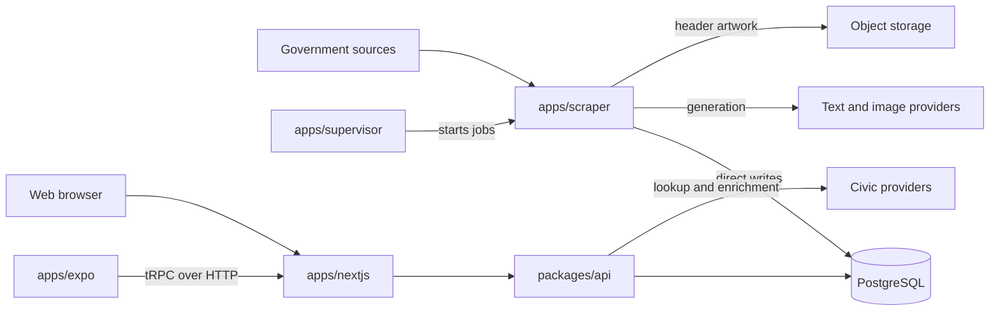

# Architecture and code tour

Billion has two main data paths. Background jobs collect government records and prepare explanations before a reader opens the app. Address-based ballot lookups happen when a reader asks for them, using provider responses and cached enrichment.

Both paths reach the mobile app through the same API. Understanding that split makes the rest of the repository easier to navigate.

## The running pieces

```mermaid
flowchart LR
    sources[Government sources] --> scraper[apps/scraper]
    supervisor[apps/supervisor] -->|starts jobs| scraper
    scraper -->|direct writes| db[(PostgreSQL)]
    scraper -->|generation| ai[Text and image providers]
    scraper -->|header artwork| storage[Object storage]
    phone[apps/expo] -->|tRPC over HTTP| next[apps/nextjs]
    browser[Web browser] --> next
    next --> api[packages/api]
    api --> db
    api -->|lookup and enrichment| civic[Civic providers]
```

`apps/nextjs` hosts the website, public article previews, auth endpoints, and `/api/trpc`. `packages/api` defines the procedures it serves; it is a library, not another server to start. Expo calls those procedures over HTTP. Server-rendered web pages can call the same router in-process.

`apps/scraper` is a separate Node process with direct database access. `apps/supervisor` starts production jobs one at a time and owns their schedules, timeouts, and retry state. The scraper's own item concurrency is a separate setting.

PostgreSQL holds source records, generated text, user data, and caches. Production uses Supabase for Postgres and generated header-image storage. Better Auth owns application sessions. Clients receive API results and image URLs; database credentials stay on the server.

## Follow a bill to the screen

Read these files in order. Each step answers a different question about the same feature.

1. [Scraper registry](../apps/scraper/src/scrapers.ts): which sources actually run? A source file existing on disk does not mean it is registered.
2. [Congress adapter](../apps/scraper/src/scrapers/congress.ts): how does an upstream bill become input to our pipeline? Federal bills come from Congress.gov; the [Open States adapter](../apps/scraper/src/scrapers/open-states.ts) maps state bills into the same `Bill` model.
3. [Content writes](../apps/scraper/src/utils/db/operations.ts): when do we insert, update, regenerate, or defer a record? Content hashes identify changed input. Budgets and source quality determine whether enrichment can finish.
4. [Database schema](../packages/db/src/schema.ts): what survives the job? `Bill` keeps source fields; `ContentBrief`, `ContentLens`, and `ContentImage` keep derived explanations and artwork metadata.
5. [Content router](../packages/api/src/router/content.ts): what does a client receive? `getByType` paginates Browse, `search` searches stored content, and `getById` assembles detail data.
6. [Browse screen](<../apps/expo/src/app/(tabs)/index.tsx>) and [article detail](../apps/expo/src/app/article-detail.tsx): how does the response become a page? The detail route requests an ID and renders the explanation, original text, sources, and available supporting material.

If a card is missing, trace that order. First establish whether the source record exists, then whether enrichment completed, then whether API filters select it. A rendering change cannot repair missing ingestion.

## Follow a ballot lookup

The [Elections screen](<../apps/expo/src/app/(tabs)/elections.tsx>) accepts an address. The [Places router](../packages/api/src/router/places.ts) resolves autocomplete results into an address; the [civic router](../packages/api/src/router/civic.ts) requests Democracy Works voter information. [Measure enrichment](measure-enrichment.md) and [candidate enrichment](candidate-enrichment.md) add evidence from other sources.

These lookups use `civic_api_cache` with endpoint-specific expiry. The schema includes election, contest, and candidate tables, but their existence does not mean every request persists a normalized ballot. For example, candidate enrichment uses the cache. Follow the relevant router's write path when deciding where data lives.

## Terms used in the code

| Term           | Meaning here                                                                   |
| -------------- | ------------------------------------------------------------------------------ |
| Content        | A stored bill, presidential document, or court case                            |
| Brief          | A structured explanation of a bill, validated with shared schemas              |
| Lens           | An explanation of competing perspectives, with sources                         |
| Contest        | A ballot entry, either a candidate race or referendum                          |
| Jurisdiction   | The government area a record belongs to; affects filtering and source identity |
| Source adapter | Code that fetches one provider's format and translates it into our model       |
| Enrichment     | Additional explanation or evidence attached to source data                     |
| Cursor         | A saved position in an upstream feed, used for incremental discovery           |

The `video` router and Feed route remain for compatibility, but `video.getInfinite` returns an empty page and the Feed tab is hidden. New content work should start with `content`, not the retired video path.

## Package boundaries

| Package            | Owns                                                            | Common consumers                                       |
| ------------------ | --------------------------------------------------------------- | ------------------------------------------------------ |
| `@acme/api`        | Request validation, API procedures, civic integrations          | Next.js server; client type imports                    |
| `@acme/db`         | Drizzle client, schema, migrations, seeds                       | API, auth, scraper                                     |
| `@acme/auth`       | Better Auth server configuration and native callback bridge     | Next.js                                                |
| `@acme/env`        | Variable definitions, validation, local file loading, setup CLI | Server apps, database tools, onboarding                |
| `@acme/ui`         | Theme tokens and reusable UI                                    | Next.js and Expo, through platform-appropriate exports |
| `@acme/validators` | Shared structured data schemas, including bill briefs           | Database types, API, scraper                           |

The pnpm workspace links these packages locally. Turborepo coordinates commands and dependency builds. Some packages expose source for bundlers and generated declarations for TypeScript; a fresh checkout may need dependency builds before a package-specific check. See [Troubleshooting](troubleshooting.md#missing-declarations-or-js-extension-errors).

## Decisions that matter when making changes

The shared tRPC router keeps request and response types aligned across web and mobile. Runtime input validation still matters, and protected procedures must scope user data to the authenticated user. See [API](api.md).

The scraper writes through Drizzle because it is already a trusted server process. Content hashes and stored generation results keep repeated source fetches from paying for the same enrichment. Changing a cache key or model-version key can therefore trigger a large backfill. See [Scraper pipeline](scraper.md).

Source evidence and generated explanation are separate. A candidate biography must come from sources; a measure summary needs supporting material. Sparse results are preferable to invented civic facts. See the two enrichment guides above and [article generation](article-generation.md).

Schema changes ship as reviewed SQL migrations. `db:push` is for disposable local setup; production migration application is an explicit operational step. See [Data layer](data-layer.md#migrations).

## What runs where

Local `pnpm dev` starts Next.js and Expo with their workspace dependencies. It excludes background ingestion and the supervisor. Production web/API deployment uses Vercel; scraper containers run on `big-mac` under the supervisor. CI publishes scraper images from `main`, and the deploy script pins a tested image. See [Supervisor operations](../apps/supervisor/README.md).

Merges to `main` publish mobile updates to the preview channel after checks. Production OTA updates require a matching native fingerprint; a new native binary follows the [iOS release guide](ios-release.md).

For exact dependency versions, read the package manifests and [pnpm catalog](../pnpm-workspace.yaml). For current checks and release triggers, read [CI](../.github/workflows/ci.yml). Those files are authoritative; this guide explains how their pieces fit together.
