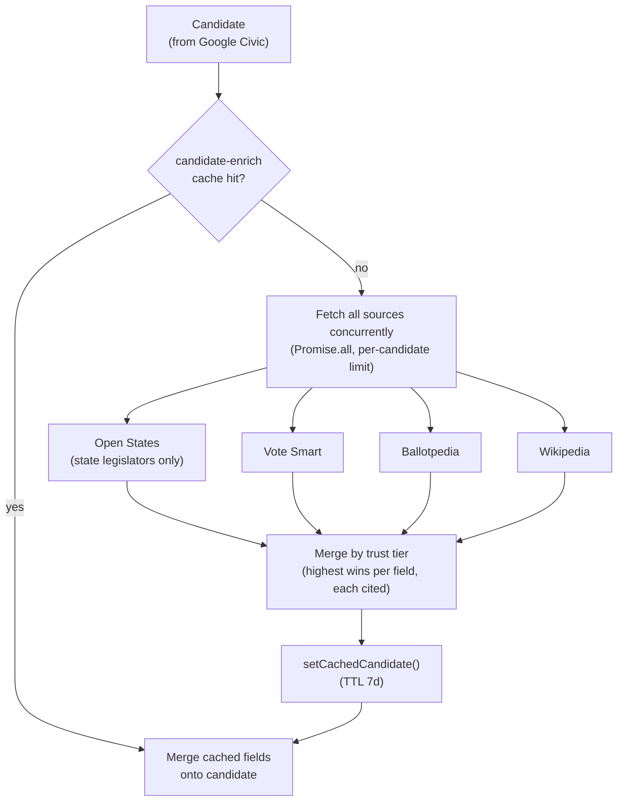

# Candidate Enrichment

The [measure cross-validation pattern](./measure-enrichment.md) applied to **candidates** in a non-referendum contest. Google Civic returns a candidate's name and party but rarely a biography, photo, incumbency flag, or contact channels. `enrichCandidate` (in `civic.ts`) fans out per candidate through a candidate cross-validation engine (`packages/api/src/lib/candidate-crossvalidate.ts`) that fetches every source concurrently and merges **field-by-field by the same trust tiers** as measures — the highest-tier source holding a field wins it and is cited.

## Source adapters

Adapters live in `packages/api/src/lib/candidate-sources/` (sharing the measure pipeline's `SourceTier`, citation shape, and fetch/HTML helpers via `candidate-sources/types.ts`):

| Source             | Adapter                | Contributes                                                     | Scope / gate                                                                                                  |
| ------------------ | ---------------------- | --------------------------------------------------------------- | ------------------------------------------------------------------------------------------------------------- |
| CA SOS Voter Guide | `ca-sos-voterguide.ts` | candidate statement (biography), email, phone, website, socials | **CA statewide offices only** — gates on `stateAbbrev === "CA"` + office→slug map; tier `state_sos`, official |
| Open States        | `open-states.ts`       | incumbent flag, photo, email, phone, website, socials           | **State legislators only** (gates on level/roles)                                                             |
| Vote Smart         | `votesmart.ts`         | biography, photo, office phone, website/email                   | resolve `candidateId` by name+state (`VOTE_SMART_API_KEY`)                                                    |
| Ballotpedia        | `ballotpedia.ts`       | biography, photo                                                | slugify name → article HTML; disambiguation guard                                                             |
| Wikipedia          | `wikipedia.ts`         | biography (intro extract), photo                                | no key; collision guard (must read as a political bio)                                                        |

## Key differences from the measure engine

- **No AI authoring of bios.** Every source that yields prose already returns a real, attributed `biography`. There is no grounded-AI fallback — when no source has a bio, the UI shows its sparse fallback rather than a guess from a bare name.
- **Collision defense.** A bare name ("John Smith") can resolve to a disambiguation page or an unrelated person. Ballotpedia and Wikipedia both guard against this — reject disambiguation pages, require the text to read like a political biography, and (Wikipedia) bias the title search with office + state. `candidateNameSimilarity()` (token Jaccard, accept at ≥0.7) matches a candidate across sources whose names vary by nickname/middle-name/suffix.
- **Cache-only, no DB rows.** Candidates are _not_ persisted to `candidate`/`contest`. The `civic_api_cache` row IS the storage, under endpoint `candidate-enrich`, keyed globally by `name + office + electionYear` plus optional disambiguators (`stateAbbrev`, `district`, `county`) so two same-name candidates in different places don't collide. TTL is **7 days** (bios change rarely; longer than the 24h voter-info TTL), so it also survives eviction of the voter-info response that triggered it.

Enriched fields are merged back onto the candidate, never clobbering existing Google Civic data with empties; per-candidate failures are swallowed so one bad lookup can't break the contest.

