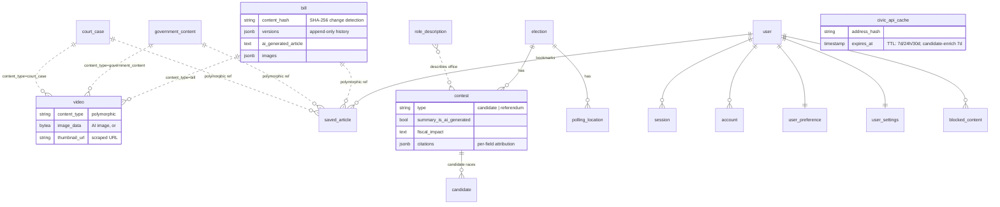

# Data Layer

## Why Drizzle ORM

We use [Drizzle ORM](https://orm.drizzle.team/) over a **PostgreSQL** backend hosted on **Supabase** (connection string points at `pooler.supabase.com:6543`).

Drizzle was chosen because:

- **Schema-as-code with full type inference.** Every query's TypeScript type is derived from the schema definition — no codegen, no type drift. Change a column and TypeScript immediately flags every affected callsite.
- **Thin abstraction.** Drizzle stays close to SQL; there's no opaque query builder hiding what's sent to the database.
- **drizzle-zod integration.** Insert schemas (`createInsertSchema`) are derived directly from table definitions, keeping validation in sync with the DB.

**Why not the Supabase client directly?** Supabase's PostgREST JS client generates relatively loose types (`Json` for JSONB, unions that don't reflect actual data shapes, no inference across joins). With a non-trivial schema — polymorphic references, typed JSONB columns, per-field citation arrays — Drizzle's precise inferred types matter. Using Supabase as the Postgres _host_ is fine; using its client as the _ORM_ loses too much type fidelity.

## DB Client

`packages/db/src/client.ts` exports a lazy-initialized `db` singleton via a `Proxy`. The Drizzle connection (`drizzle-orm/node-postgres`, native `pg` driver, `snake_case` casing) isn't created until the first query, so importing the package never opens a connection on its own.

Because the driver opens a raw TCP socket via Node's `net`/`tls`, **only server-side code can use the DB client directly.** The mobile app's JS runtime has no socket layer (see [Frontend apps](./frontend.md)).

## Migrations

Migrations use `drizzle-kit` with versioned SQL files under `packages/db/drizzle/`. `drizzle.config.ts` strips the pooler port `:6543` down to direct `:5432`, since DDL doesn't play well with the transaction pooler.

### Why this workflow exists

The database workflow is **schema-first, migration-applied**. `schema.ts` remains
the source of truth for application types, but shared databases are changed by
committed SQL migrations instead of being synchronized directly from whatever
schema happens to be in a developer's checkout.

| Previously (`db:push`)                              | Migration workflow                                                    |
| --------------------------------------------------- | --------------------------------------------------------------------- |
| Drizzle changed the target database directly.       | Drizzle generates a numbered SQL file for review.                     |
| There was no committed record of the operation.     | The SQL and its schema snapshot are committed together.               |
| Environments could receive different changes.       | Every environment applies the same migrations in the same order.      |
| The operator had to infer whether a change had run. | Drizzle records applied migrations in `drizzle.__drizzle_migrations`. |

`db:push` remains useful for disposable local experimentation, but never use it
against a shared, staging, or production database. Anything intended to ship
must use the migration workflow below.

### Authoring a schema change

1. Edit `packages/db/src/schema.ts`.
2. Run `pnpm db:generate`. Drizzle diffs the schema against the last snapshot and writes a new `NNNN_*.sql` migration plus a `meta/` snapshot.
3. Review the generated SQL. Pay particular attention to drops, renames, `NOT NULL` changes, long-running index creation, extension requirements, and operations that rewrite or lock large tables.
4. Run `pnpm db:check` to validate the committed migration history for collisions.
5. Commit the SQL migration and its `meta/` snapshot together with the schema change.
6. Apply the change to a development database with `pnpm db:migrate` and exercise the affected application paths.

Do not edit or reorder a migration after it has been applied to a shared
database. Add a new forward migration instead. `db:check` validates migration
history; it does **not** compare that history with the live database or detect
schema drift. `pnpm db:studio` opens the data browser.

Data backfills and other changes that cannot safely be represented by generated
schema DDL need an explicit rollout plan. Historical one-off operations live in
`packages/db/manual-sql/`; they are provenance, not an automatically replayed
migration queue.

### Applying migrations

`pnpm db:migrate` applies pending migrations to the database selected by the
root `POSTGRES_URL`. Drizzle records each successful migration in
`drizzle.__drizzle_migrations` and skips it on subsequent runs. Confirm the
environment represented by `POSTGRES_URL` before any migration or baseline
command; both commands mutate that database.

For a **brand-new database**:

1. Set `POSTGRES_URL` for the new database.
2. Run `pnpm db:migrate` to create the schema from the complete history.
3. Seed the database if the environment requires seed data.
4. Start the application and smoke-test database-backed flows.

For a normal **staging or production deployment** after migration tracking has
been adopted:

1. Review the migration SQL and its operational impact before deployment.
2. Take a backup or confirm a recent restorable backup for destructive or difficult-to-reverse changes.
3. Apply the migration to staging and run application smoke tests.
4. Confirm `POSTGRES_URL` targets the intended production database.
5. Run `pnpm db:migrate` once as an explicit deployment step, before releasing code that depends on the new schema unless the change was designed to be backward-compatible.
6. Verify the application and the new schema behavior after deployment.

This repository does not currently run production migrations automatically.
The person or deployment system performing a release owns the `db:migrate`
step. Running it more than once is safe because already-recorded migrations are
skipped.

### Baselining an existing database

Databases created before this workflow had their schema applied with `db:push`.
They already contain the objects represented by the initial migration history,
so running `db:migrate` first would try to create those objects again and fail.

`pnpm db:baseline` adopts one of these databases by inserting the exact hashes
and timestamps expected by Drizzle into `drizzle.__drizzle_migrations`. It is
idempotent and leaves hashes that are already present alone.

> **Important:** `db:baseline` does not inspect or repair the live schema. It
> marks every migration currently present in `packages/db/drizzle/` as applied.
> Run it only when the database is known to already contain all of those schema
> changes. Running it against a new, partial, or drifted database can hide
> missing DDL from future `db:migrate` runs.

For each pre-migration development, staging, or production database:

1. Confirm that the database was previously kept current with `db:push` and matches the schema represented by the migrations in this checkout.
2. Take a backup or confirm that a recent backup can be restored.
3. Set and verify `POSTGRES_URL` for that specific environment.
4. Run `pnpm db:baseline` exactly once during adoption of this workflow.
5. Inspect `drizzle.__drizzle_migrations` and confirm that the expected initial migrations were recorded.
6. Run `pnpm db:migrate`; it should report no pending initial schema work.
7. Start the application and smoke-test database-backed flows.

Brand-new databases skip baselining and run `pnpm db:migrate` directly.

The initial history is intentionally split into two migrations:

- `0000_baseline.sql` describes the complete schema that existed when migration tracking was introduced.
- `0001_premium_famine.sql` captures the subsequently generated content-lens, full-text search, trigram extension, and index changes that were already present in databases kept current with `db:push`.

### Failure and recovery

Drizzle does not provide an automatic down-migration workflow here. If a
migration fails, preserve its output, determine whether PostgreSQL rolled back
the operation, and inspect both the affected objects and
`drizzle.__drizzle_migrations` before retrying. Do not manually insert or delete
migration records merely to make the next run proceed.

For a migration that has already succeeded on a shared database, correct it
with a new forward migration. For destructive changes where a forward repair is
not sufficient, restore the verified backup according to the environment's
database recovery procedure before redeploying compatible application code.

## Schema Overview

The schema (`packages/db/src/schema.ts` + better-auth-generated `auth-schema.ts`) has ~20 tables in five groups.

**Government content** — the scraped source material:

| Table                | Purpose                                                                            |
| -------------------- | ---------------------------------------------------------------------------------- |
| `bill`               | Congressional legislation (congress.gov)                                           |
| `government_content` | Presidential documents — EOs, proclamations, memoranda, notices (Federal Register) |
| `court_case`         | SCOTUS & federal court opinions (CourtListener)                                    |
| `post`               | Legacy sample-post table from the T3 template                                      |

All three content tables share a common pattern:

- `content_hash` (SHA-256 over key fields) — detects changes between scrape runs to avoid redundant AI generation
- `versions` (JSONB array) — append-only `{ hash, updatedAt, changes }` log
- `ai_generated_article` — AI-enriched markdown stored on the row
- `images` (JSONB array) — `{ url, alt, source, sourceUrl }[]`
- `thumbnail_url` — primary display image

**Feed layer:**

| Table   | Purpose                                                                                                                                                                                                                                                                 |
| ------- | ----------------------------------------------------------------------------------------------------------------------------------------------------------------------------------------------------------------------------------------------------------------------- |
| `video` | Derived feed cards — one row per content item via a polymorphic `(content_type, content_id)` ref. Holds AI marketing copy (title ≤25 chars, ~50-word description) and either a JPEG in `image_data` (`bytea`) or a scraped `thumbnail_url`. `engagement_metrics` JSONB. |

**Civic / elections** — the voter-information model:

| Table              | Purpose                                                                                                                                                                                                                                                                                     |
| ------------------ | ------------------------------------------------------------------------------------------------------------------------------------------------------------------------------------------------------------------------------------------------------------------------------------------- |
| `election`         | Election records (external id, date, type, OCD division, deadlines JSONB)                                                                                                                                                                                                                   |
| `contest`          | Races _and_ ballot measures. `type` = candidate \| referendum. For measures: `referendum_title`, pro/con statements, `summary`, `summary_is_ai_generated`, `fiscal_impact`, and a `citations` JSONB array (per-field source attribution: field, source name/url, trust tier, official flag) |
| `candidate`        | Candidates within a contest (party, incumbent, contact, bio)                                                                                                                                                                                                                                |
| `polling_location` | Polling places / early-vote sites / drop boxes, geo-located (lat/long), with hours                                                                                                                                                                                                          |
| `role_description` | Reusable descriptions of offices/roles by level (seeded with ~18 federal→local roles)                                                                                                                                                                                                       |

**Local government (Legistar cache)** — `legistar_body`, `legistar_matter`, `legistar_meeting`, `legistar_agenda_item`, `legistar_vote`. These cache San Jose / Santa Clara / Sunnyvale council data (ordinances, meetings, agenda items, votes) keyed by `(jurisdiction, *_id)` with a `fetched_at` timestamp.

**User engagement & caching:**

| Table             | Purpose                                                                                                                                                                                                                     |
| ----------------- | --------------------------------------------------------------------------------------------------------------------------------------------------------------------------------------------------------------------------- |
| `saved_article`   | Bookmarks — polymorphic `(content_type, content_id)` per user                                                                                                                                                               |
| `user_preference` | Preferred topics / content types (JSONB string arrays)                                                                                                                                                                      |
| `blocked_content` | Hidden sources/topics                                                                                                                                                                                                       |
| `user_settings`   | Privacy & consent flags (location, personalize, analytics, crash, offline)                                                                                                                                                  |
| `civic_api_cache` | Google Civic responses **and** enrichment results, keyed by `(address_hash, endpoint, params)` with `expires_at` TTL. Also backs per-candidate enrichment under endpoint `candidate-enrich` (global `address_hash`, 7d TTL) |

**Auth** — better-auth-managed `user`, `session`, `account`, `verification` (regenerated into `auth-schema.ts` via `pnpm auth:generate`).

## Key Relationships

The content tables feed the `video` table and are referenced by `saved_article` through the same polymorphic `(content_type, content_id)` pair — neither uses a foreign key, so the dashed links below denote polymorphic refs, not enforced constraints.

