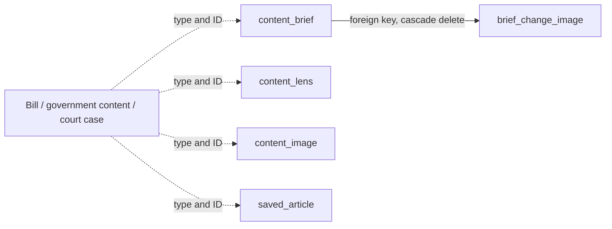

# Data layer

The database separates records fetched from government sources from the explanations and artwork generated from them. Start with that distinction before reading individual columns. The complete definitions live in [schema.ts](../packages/db/src/schema.ts); [auth-schema.ts](../packages/db/src/auth-schema.ts) contains Better Auth's generated tables.

## Source records and derived content

| Table or group                    | What it stores                                                                                             |
| --------------------------------- | ---------------------------------------------------------------------------------------------------------- |
| `bill`                            | Federal and state legislation, source identity, text, status, actions, and source or generated description |
| `government_content`              | Presidential documents collected from White House and Federal Register sources                             |
| `court_case`                      | Stored court opinions; the CourtListener scraper is currently unregistered                                 |
| `content_brief`                   | Structured bill explanations, validated by `@acme/validators`                                              |
| `content_lens`                    | Competing perspectives with citations and generation metadata                                              |
| `content_image`                   | Generated header-art storage paths, hashes, prompts, and dimensions                                        |
| `content_image_review`            | Validated DeepSeek suitability decisions, reasons, and terminal rejection state for generated header art   |
| `brief_change_image`              | Artwork for individual changes in a brief, including explicit decisions to omit an image                   |
| `bill_interest`, `featured_bill`  | Editorial assessments and featured-bill selection                                                          |
| `scraper_cursor`, `scraper_retry` | Source discovery progress and work that needs another attempt                                              |

Content hashes let generation code compare its inputs with stored results. Each derived asset has its own reuse rules; for example, a lens uses its generation inputs so a routine status change need not regenerate the arguments. See [Scraper pipeline](scraper.md).

Generated header bytes live in object storage; `content_image` keeps the path and checksum in Postgres. `brief_change_image` still supports binary data in `image_data`. These are separate storage paths. The former `video` table is absent from the current schema, and its API endpoint is a compatibility stub.

## Civic data and local decisions

The election model has `election`, `contest`, `candidate`, `polling_location`, and `role_description` tables. A contest can be a candidate race or a referendum. Request-time civic results and enrichment also use `civic_api_cache`, keyed by address hash, endpoint, and parameters with an expiry timestamp. Candidate enrichment is cache-based; do not assume every ballot response becomes normalized election rows.

Local government uses the `local_*` tables. A `local_decision` represents a matter; `local_meeting_item` represents its occurrence at a meeting. Keeping those distinct allows one matter to appear across multiple meetings. Related tables retain documents, history, votes, source provenance, and ingestion runs. Read [Local government and Legistar](local-government-legistar.md) before changing their lifecycle or geography rules.

## User data and relationships

Better Auth owns `user`, `session`, `account`, and `verification`. Application tables store preferences, settings, blocked content, and saved articles. `post` remains a legacy example from the original template.

`user_preference` has at most one row per authenticated user. Its `topics` and `content_types` columns are JSONB string arrays. The protected `user.getPreferences` and `user.setPreferences` procedures derive the owner from the session and read or upsert that row. These server preferences are separate from Expo's account-free onboarding record in AsyncStorage. Finishing onboarding copies topics and content types to PostgreSQL only when a session already exists; it does not synchronize the rest of the device record, including alert choices.

`saved_article` and the derived content tables identify their source through a `content_type` and `content_id` pair. Those polymorphic references do not enforce a foreign key to every possible source table. Deletion and retention code must account for related rows explicitly. By contrast, `brief_change_image.content_brief_id` has a foreign key with cascade deletion.

```mermaid
flowchart LR
    source[Bill / government content / court case]
    source -. type and ID .-> brief[content_brief]
    source -. type and ID .-> lens[content_lens]
    source -. type and ID .-> image[content_image]
    source -. type and ID .-> saved[saved_article]
    brief -->|foreign key, cascade delete| changes[brief_change_image]
```

## Database access

[client.ts](../packages/db/src/client.ts) exports a lazy Drizzle singleton backed by the Node PostgreSQL driver. Importing it does not open a connection; accessing it initializes the client from `POSTGRES_URL`. It uses `snake_case` database names and typed table definitions.

The API, auth package, and scraper use this client on the server. Mobile and browser code use the API. Drizzle provides typed queries; Zod and drizzle-zod validate data at runtime. These checks serve different purposes.

Production Postgres is hosted on Supabase, while development can use ordinary local Postgres. The database tools load repository environment files through `@acme/env/load`; existing process variables win, followed by root `.env.local`, then root `.env`. Confirm the effective target before running a write command.

## Migrations

Migrations use `drizzle-kit` with versioned SQL files under `packages/db/drizzle/`. `drizzle.config.ts` strips the pooler port `:6543` down to direct `:5432`, since DDL doesn't play well with the transaction pooler.

### Why this workflow exists

The database workflow is **schema-first, migration-applied**. `schema.ts` remains
the source of truth for application types, but shared databases are changed by
committed SQL migrations instead of being synchronized directly from whatever
schema happens to be in a developer's checkout.

| Previously (`db:push`)                              | Migration workflow                                                    |
| --------------------------------------------------- | --------------------------------------------------------------------- |
| Drizzle changed the target database directly.       | Drizzle generates a numbered SQL file for review.                     |
| There was no committed record of the operation.     | The SQL and its schema snapshot are committed together.               |
| Environments could receive different changes.       | Every environment applies the same migrations in the same order.      |
| The operator had to infer whether a change had run. | Drizzle records applied migrations in `drizzle.__drizzle_migrations`. |

`db:push` remains useful for disposable local experimentation, but never use it
against a shared, staging, or production database. Anything intended to ship
must use the migration workflow below.

### Authoring a schema change

1. Edit `packages/db/src/schema.ts`.
2. Run `pnpm db:generate`. Drizzle diffs the schema against the last snapshot and writes a new `NNNN_*.sql` migration plus a `meta/` snapshot.
3. Review the generated SQL. Pay particular attention to drops, renames, `NOT NULL` changes, long-running index creation, extension requirements, and operations that rewrite or lock large tables.
4. Run `pnpm db:check` to validate the committed migration history for collisions.
5. Commit the SQL migration and its `meta/` snapshot together with the schema change.
6. Apply the change to a development database with `pnpm db:migrate` and exercise the affected application paths.

Do not edit or reorder a migration after it has been applied to a shared
database. Add a new forward migration instead. `db:check` validates migration
history; it does **not** compare that history with the live database or detect
schema drift. `pnpm db:studio` opens the data browser.

Data backfills and other changes that cannot safely be represented by generated
schema DDL need an explicit rollout plan. Historical one-off operations live in
`packages/db/manual-sql/`; they are provenance, not an automatically replayed
migration queue.

### Applying migrations

`pnpm db:migrate` applies pending migrations to the database selected by the
root `POSTGRES_URL`. Drizzle records each successful migration in
`drizzle.__drizzle_migrations` and skips it on subsequent runs. Confirm the
environment represented by `POSTGRES_URL` before any migration or baseline
command; both commands mutate that database.

For a **brand-new database**:

1. Set `POSTGRES_URL` for the new database.
2. Run `pnpm db:migrate` to create the schema from the complete history.
3. Seed the database if the environment requires seed data.
4. Start the application and smoke-test database-backed flows.

For a normal **staging or production deployment** after migration tracking has
been adopted:

1. Review the migration SQL and its operational impact before deployment.
2. Take a backup or confirm a recent restorable backup for destructive or difficult-to-reverse changes.
3. Apply the migration to staging and run application smoke tests.
4. Confirm `POSTGRES_URL` targets the intended production database.
5. Run `pnpm db:migrate` once as an explicit deployment step, before releasing code that depends on the new schema unless the change was designed to be backward-compatible.
6. Verify the application and the new schema behavior after deployment.

This repository does not currently run production migrations automatically.
The person or deployment system performing a release owns the `db:migrate`
step. Running it more than once is safe because already-recorded migrations are
skipped.

### Baselining an existing database

Databases created before this workflow had their schema applied with `db:push`.
They already contain the objects represented by the initial migration history,
so running `db:migrate` first would try to create those objects again and fail.

`pnpm db:baseline` adopts one of these databases by inserting the exact hashes
and timestamps expected by Drizzle into `drizzle.__drizzle_migrations`. It is
idempotent and leaves hashes that are already present alone.

> **Important:** `db:baseline` does not inspect or repair the live schema. It
> marks only the two fixed adoption migrations, `0000_baseline` and
> `0001_premium_famine`, as applied. Run it only when the database is known to
> already contain both migrations' schema changes. Running it against a new,
> partial, or drifted database can hide missing DDL from future `db:migrate`
> runs. Newer migrations remain pending and are applied by `db:migrate`.

For each pre-migration development, staging, or production database:

1. Confirm that the database was previously kept current with `db:push` and contains the schema represented by `0000_baseline` and `0001_premium_famine`.
2. Take a backup or confirm that a recent backup can be restored.
3. Set and verify `POSTGRES_URL` for that specific environment.
4. Run `pnpm db:baseline` exactly once during adoption of this workflow.
5. Inspect `drizzle.__drizzle_migrations` and confirm that the two adoption migrations were recorded.
6. Run `pnpm db:migrate`; it applies any migrations added after the fixed adoption cutoff.
7. Start the application and smoke-test database-backed flows.

Brand-new databases skip baselining and run `pnpm db:migrate` directly.

The initial history is intentionally split into two migrations:

- `0000_baseline.sql` describes the complete schema that existed when migration tracking was introduced.
- `0001_premium_famine.sql` captures the subsequently generated content-lens, full-text search, trigram extension, and index changes that were already present in databases kept current with `db:push`.

### Failure and recovery

Drizzle does not provide an automatic down-migration workflow here. If a
migration fails, preserve its output, determine whether PostgreSQL rolled back
the operation, and inspect both the affected objects and
`drizzle.__drizzle_migrations` before retrying. Do not manually insert or delete
migration records merely to make the next run proceed.

For a migration that has already succeeded on a shared database, correct it
with a new forward migration. For destructive changes where a forward repair is
not sufficient, restore the verified backup according to the environment's
database recovery procedure before redeploying compatible application code.
