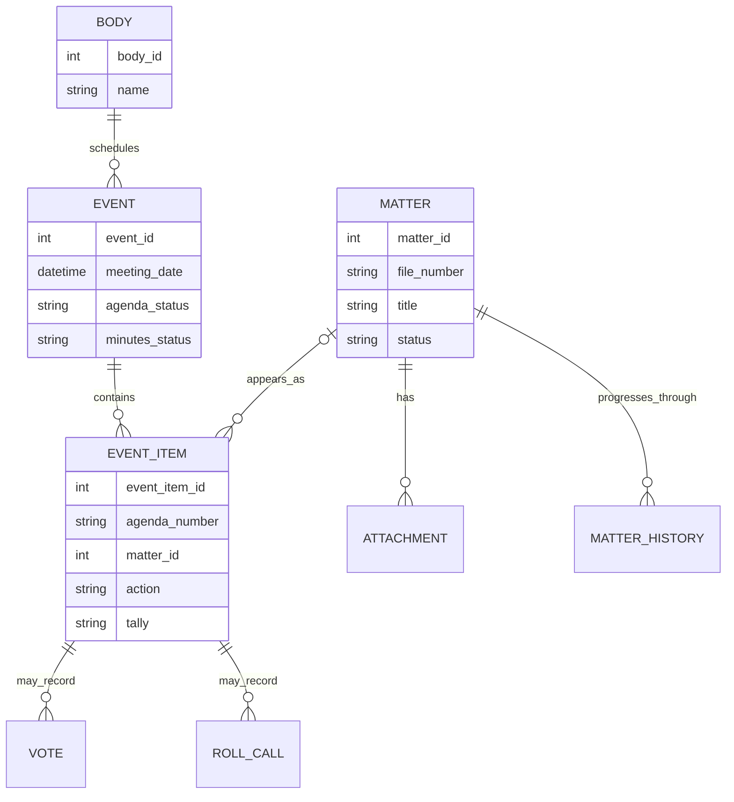
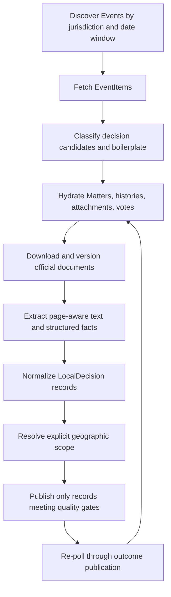

# Local Government Decisions and Legistar

> Status: Draft RFC
>
> Initial jurisdiction: City of San José
> Tracking issue: [#282](https://github.com/billion-app/billion/issues/282)

This document defines how Billion should ingest, normalize, and explain local-government decisions from Legistar. It is intentionally more specific than a data-source setup guide: Legistar is a records-management system with a publication lifecycle, not a feed of interchangeable "local bills."

The existing integration in `packages/api/src/integrations/legistar.ts` is useful scaffolding. It is an on-demand API client with a 24-hour database cache. It is not yet the ingestion system described here.

## Why this is a subsystem

A local decision can be proposed, amended, deferred, heard by multiple bodies, returned at a later meeting, and finally recorded in minutes weeks after the meeting. Different facts may be published in different artifacts:

- Legistar JSON for meetings, agenda items, matters, bodies, and attachments;
- an agenda or amended-agenda PDF for the item number and recommendation;
- a staff memorandum for fiscal impact and geographic scope;
- meeting minutes for the actual motion, action, tally, and named exceptions;
- a video or transcript for explanatory context;
- a separate GIS service for address and council-district relevance.

Treating this as another bill API would lose the relationship between a proposal, the meeting at which it was considered, the evidence supporting it, and the outcome actually recorded by the city.

## Source-system model

Legistar exposes several related record types. Their names should remain visible in adapter code even when Billion presents friendlier product language.



### Body

A council, committee, board, commission, hearing body, or other government unit. Bodies are jurisdiction-specific and should not be hard-coded into shared product components.

### Event

A scheduled meeting. An Event owns meeting time, location, agenda/minutes publication status, and links to meeting artifacts.

### EventItem

One row in an Event's agenda or minutes. This is the closest Legistar record to a decision occurrence, but not every EventItem is a decision. San José also publishes section headings, interpretation instructions, participation instructions, and other boilerplate as EventItems.

Meeting-specific outcomes—motion, action, tally, mover, seconder, and votes—belong to the EventItem, not to the Matter in the abstract.

### Matter

A reusable record for a proposal, report, ordinance, resolution, contract, land-use action, or other file. A Matter may appear at multiple meetings and before multiple bodies. It may also exist before it is scheduled.

Consequently:

- `MatterId` is not a unique decision ID;
- Matter modification time is not a reliable decision date;
- the latest modified Matters are not necessarily the decisions residents should see;
- a Matter timeline must be built from its meeting appearances and history.

### Attachment

An official document or hyperlink associated with a Matter. Common San José examples include memoranda, staff reports, resolutions, ordinances, presentations, supplemental memoranda, and letters from the public.

Attachments are first-class source documents. They must be retained and versioned rather than flattened into summary text.

### MatterHistory, Vote, and RollCall

Legistar defines structured history and voting endpoints. Availability is jurisdiction-dependent. A missing structured action or vote is unknown data, not evidence that no action or vote occurred.

## San José observations

The following are observations from the August 13, 2026 discovery pass and must be captured as fixtures before implementation assumptions become permanent:

- the public `sanjose` client allowed unauthenticated reads;
- an August 1 through September 30 query returned 43 Events;
- the August 11 City Council Event returned 92 EventItems, of which 33 referenced Matters;
- attachments included memoranda, ordinances, resolutions, presentations, public letters, and supplemental memoranda;
- some API agenda numbers were null even though the published agenda displayed an item number;
- completed meetings did not consistently expose structured actions or votes;
- official minutes PDFs contained richer outcomes, including motions, adopted instruments, tallies, named absences, fiscal amounts, and council districts.

These observations establish fallback requirements, not universal claims about every San José record.

## Billion domain model

The primary product record should be a `LocalDecision`, representing a proposal as considered at a particular meeting. Internally, `jurisdictionId + sourceSystem + sourceEventItemId` is its stable source identity.

```ts
interface LocalDecision {
  id: string;
  jurisdictionId: string;
  governmentLevel: "city" | "county" | "special_district";
  sourceSystem: "legistar" | string;
  sourceEventId: string;
  sourceEventItemId: string;
  sourceMatterId: string | null;

  title: string;
  summary: string | null;
  summaryIsAiGenerated: boolean;
  topic: LocalDecisionTopic | null;

  meetingBody: string;
  meetingStartsAt: string;
  agendaNumber: string | null;
  fileNumber: string | null;
  lifecycleStatus: LocalDecisionStatus;

  recommendation: string | null;
  fiscalImpact: string | null;
  geographicScope: LocalDecisionScope;
  participation: ParticipationInfo | null;
  outcome: LocalDecisionOutcome | null;

  sourcePageUrl: string | null;
  citations: LocalDecisionCitation[];
  firstObservedAt: string;
  lastObservedAt: string;
}
```

The interface is illustrative. The storage design may use normalized tables, but the API should deliver an equivalent jurisdiction-neutral contract.

### Lifecycle status

Lifecycle status must be derived from cited source state, not guessed from whether a meeting date is in the past.

Proposed normalized values:

- `scheduled`: placed on a meeting agenda;
- `amended`: the published proposal or agenda changed materially;
- `deferred`: consideration moved to a later date;
- `withdrawn`: removed by the originating body or staff;
- `cancelled`: the meeting or item was cancelled;
- `awaiting_outcome`: meeting occurred but no official outcome is available;
- `decided`: an official action is published;
- `informational`: heard or filed without an approval decision;
- `unknown`: source state cannot be normalized safely.

The raw source status and action must also be retained.

### Geographic scope

```ts
type LocalDecisionScope =
  | { kind: "citywide" }
  | { kind: "district"; districtIds: string[] }
  | { kind: "addresses"; addresses: string[]; districtIds: string[] }
  | { kind: "neighborhood"; names: string[]; districtIds: string[] }
  | { kind: "countywide" }
  | { kind: "unknown" };
```

An absent district reference is not automatically citywide. It remains `unknown` unless the source supports a citywide classification.

### Matter timeline

Multiple `LocalDecision` records may point to the same Matter. The product can group these records into a timeline while preserving each meeting occurrence and outcome.

For example:

```text
Planning Commission recommendation
  → Council first reading
  → Council final adoption
```

Grouping must use source Matter identity and explicit relations. Similar titles alone are insufficient.

## Evidence and provenance

Every material user-facing fact needs a citation. A summary-level "Sources" array is insufficient when different claims come from different documents.

```ts
interface LocalDecisionCitation {
  field:
    | "title"
    | "summary"
    | "recommendation"
    | "fiscalImpact"
    | "geographicScope"
    | "participation"
    | "outcome";
  sourceDocumentId: string;
  sourceUrl: string;
  page: number | null;
  section: string | null;
  excerpt: string | null;
  extractionMethod: "structured" | "deterministic" | "ai" | "manual";
  confidence: "high" | "medium" | "low";
}
```

Requirements:

- retain the original government URL;
- record retrieval time and content hash;
- retain document versions when content changes at the same URL;
- preserve page boundaries during PDF extraction;
- distinguish source text from Billion-authored explanation;
- never create a factual field from a title alone;
- never infer a vote from transcript sentiment or attendance;
- allow a user to open the exact supporting record.

## Source precedence

When sources disagree, use the most specific official record for the fact in question:

1. Published structured action/vote data for that EventItem.
2. Official adopted or approved meeting minutes.
3. Official amended agenda, agenda, or staff memorandum.
4. Other official attachments and meeting pages.
5. Official video/transcript as contextual evidence only.
6. Third-party sources as optional discovery or gap indicators, never silent replacements.

The most recently retrieved source does not automatically outrank an adopted record. Precedence is fact-specific and should be encoded in tests.

## Proposed ingestion pipeline



### 1. Discovery

Fetch Events within bounded windows using OData filtering and paging. Store the query window and completion marker so "some fresh cached rows" cannot be mistaken for a complete window.

### 2. Candidate classification

Start with EventItems that reference a Matter, but do not treat that as the final rule. Store excluded items and their reason during the discovery phase so jurisdiction rules can be audited.

Candidate categories should include:

- decision;
- informational report;
- procedural item;
- ceremonial item;
- participation/translation boilerplate;
- section heading;
- unknown.

### 3. Hydration

For each candidate, fetch the Matter, attachments, history, and structured votes/roll calls. Persist raw source payloads or versioned snapshots needed to reproduce normalization.

### 4. Document processing

For each official PDF or supported document:

1. validate MIME type and size;
2. compute a content hash;
3. preserve the original artifact or a durable reference permitted by source terms;
4. extract text with page boundaries;
5. use OCR only when embedded text is unavailable;
6. detect standard headings and fields deterministically first;
7. use constrained AI extraction only over retrieved text;
8. validate citations against the extracted page text.

### 5. Normalization and quality gates

A decision may be published with partial data, but missing fields must be explicit. Minimum proposed requirements for a list-card record:

- jurisdiction;
- meeting body and date;
- source EventItem identity;
- non-boilerplate title;
- direct official source link.

AI summary publication additionally requires at least one validated official citation. An outcome requires an official action source.

### 6. Refresh through outcome

An ingestion run is not complete when an upcoming agenda is first observed. The scraper must revisit the meeting through minutes publication and capture amendments along the way.

Proposed initial cadence, subject to measurement:

- broad Event discovery daily;
- meetings within 14 days every 6 hours;
- meetings within 48 hours every hour;
- completed meetings without outcomes every 6 hours for 14 days;
- then daily through 90 days;
- retain a manual reprocess command for older corrections.

Use `EventLastModifiedUtc`, `EventItemLastModifiedUtc`, document hashes, and explicit window state to avoid unnecessary reprocessing. Do not assume timestamps capture every attachment replacement; hashes remain necessary.

## Address and district relevance

The user's address and a decision's geographic scope are separate pipelines.

### User jurisdiction

1. Resolve the saved address to coordinates using the existing Places flow.
2. Query the official San José boundary/district service.
3. Store or cache the least sensitive result needed for ranking, preferably jurisdiction and district rather than duplicating coordinates broadly.
4. Do not show San José decisions as "local" when the point is outside the city.

### Decision scope

Extract explicit districts, addresses, APNs, and neighborhood names from official records. Validate addresses against official GIS where practical. Do not assign a district based solely on the sponsoring councilmember.

Ranking can place a user's district-specific decisions above citywide decisions, but must not hide citywide decisions by default.

## Participation information

Participation instructions may be meeting-wide or item-specific. Prefer the current agenda and official meeting page over a generic city participation page. Store:

- method: in person, Zoom, phone, email, or eComment;
- deadline with timezone when explicitly published;
- meeting/item identifier required in the comment;
- official URL or address;
- retrieval time because instructions can change.

Never manufacture a deadline from customary practice.

## Outcomes and votes

Outcome ingestion uses the following fallback:

1. structured EventItem action, tally, and Vote/RollCall endpoints;
2. official meeting minutes with page-level citation;
3. `awaiting_outcome` when neither is available.

Minutes extraction should capture, when present:

- final action text;
- motion and amendments;
- mover and seconder;
- pass/fail or other disposition;
- tally;
- named yes/no/abstain/absent/recused members;
- adopted ordinance or resolution number.

A compact tally is not enough to reconstruct individual yes votes unless the minutes explicitly define them.

## Jurisdiction adapters

Shared ingestion code should depend on a jurisdiction profile rather than San José conditionals spread across the pipeline.

```ts
interface LegistarJurisdictionProfile {
  jurisdictionId: string;
  clientSlug: string;
  governmentLevel: "city" | "county" | "special_district";
  canonicalHost: string;
  bodyAllowlist?: number[];
  bodyDenylist?: number[];
  boilerplateRules: string[];
  topicRules: TopicRule[];
  documentNameRules: DocumentRule[];
  participationSources: string[];
  geographicResolver: string | null;
  outcomeFallback: "minutes_pdf" | "none";
}
```

Client slugs are configuration, not reliably derivable from a public portal subdomain.

## Storage implications

The existing `legistar_*` tables can support a transition but are insufficient for the full system. The design needs durable representations for:

- completed ingestion windows and cursors;
- raw/versioned source snapshots;
- attachments/source documents and content hashes;
- Matter-to-EventItem appearances;
- normalized LocalDecision records;
- per-field citations;
- extraction attempts, parser versions, and failures;
- geographic scope;
- publication readiness and partial-data reasons.

Attachments must not disappear when an API response is served from cache. Empty vote results need a cacheable "checked at" state so a legitimate empty response does not trigger a live request on every read.

## Failure behavior

- Production must never substitute synthetic Matters for failed government reads.
- Preserve the last known official record and mark it stale when refresh fails.
- Distinguish source unavailable, document unavailable, parse failed, unsupported format, and data genuinely absent.
- Apply bounded retries and per-host rate limits.
- Quarantine malformed records rather than dropping the rest of a meeting.
- Emit metrics for Events discovered, candidates retained/excluded, documents changed, extraction failures, missing outcomes, and publication readiness.

## Security, privacy, and legal review

- Treat public-comment letters as potentially containing personal information; do not summarize or index individual commenters by default.
- Confirm source terms for storing government-hosted documents versus retaining hashes and URLs.
- Respect removal or redaction of source documents while retaining an internal audit event appropriate to policy.
- Avoid sending a user's street address to Legistar or an AI provider.
- Ensure AI providers receive only the official document excerpts needed for extraction.

## Discovery fixtures

Before schema work, capture immutable test fixtures from at least:

1. an upcoming San José City Council meeting with attachments and participation instructions;
2. a completed meeting whose structured Legistar outcome is sparse but whose minutes contain actions and tallies;
3. a Matter that appears at multiple meetings;
4. an amended or deferred item;
5. a non-Matter EventItem that should be excluded;
6. a district-specific land-use or contract item;
7. an item with no determinable geographic scope;
8. a meeting with an unavailable or replaced attachment.

Fixture metadata must record retrieval time, request URL, response headers needed for reproduction, and content hashes. Tests should operate offline.

## Implementation phases

### Phase 0: discovery and contracts

- capture fixtures;
- verify San José field population and publication delays;
- finalize the LocalDecision and citation contracts;
- document source terms and retention policy;
- define quality metrics and expected partial states.

### Phase 1: official structured ingestion

- register a Legistar scraper in `apps/scraper` and `apps/supervisor`;
- ingest Events, EventItems, Matters, bodies, histories, attachments, and structured votes;
- implement complete window paging, idempotent upserts, versioning, and replay;
- remove production mock fallbacks.

### Phase 2: document evidence

- download/version attachments;
- implement page-aware extraction and citation validation;
- normalize recommendation, fiscal impact, explicit scope, and participation;
- add minutes-based outcome fallback.

### Phase 3: geographic relevance and API

- resolve user jurisdiction/district;
- expose list, detail, timeline, and source-document APIs;
- rank district-specific and citywide decisions;
- surface partial/stale/source-failure states.

### Phase 4: additional jurisdictions

- extract San José parsing into a jurisdiction profile;
- validate the shared contract against a second Legistar jurisdiction;
- add non-Legistar adapters only after the domain contract survives that comparison.

## Open questions

1. Which San José bodies belong in the first release besides City Council and standing committees?
2. Should each reading/adoption be a separate LocalDecision or a timeline step with one canonical card?
3. How long may official documents be retained locally under source terms?
4. Which document types require OCR in practice, and what is the acceptable error rate?
5. How should amended recommendations be compared and presented?
6. What publication delay should trigger a visible "outcome pending" state?
7. When a district is mentioned only in supporting material, what confidence is required before ranking?
8. Should public letters be excluded entirely from AI processing in the first release?
9. Which source fields must be immutable audit history versus latest-state columns?
10. What review sample and accuracy threshold are required before AI-extracted facts ship?

## Definition of done for the discovery spike

The discovery phase is complete when:

- the fixture set above is checked in or stored in an approved fixture location;
- every fixture can be normalized offline into the draft LocalDecision contract;
- every populated factual field has a resolvable citation;
- known unknowns and conflicting-source behavior are represented in tests;
- polling and storage estimates are based on measured San José volumes;
- the team has explicitly approved the domain model, provenance policy, and production failure behavior.
