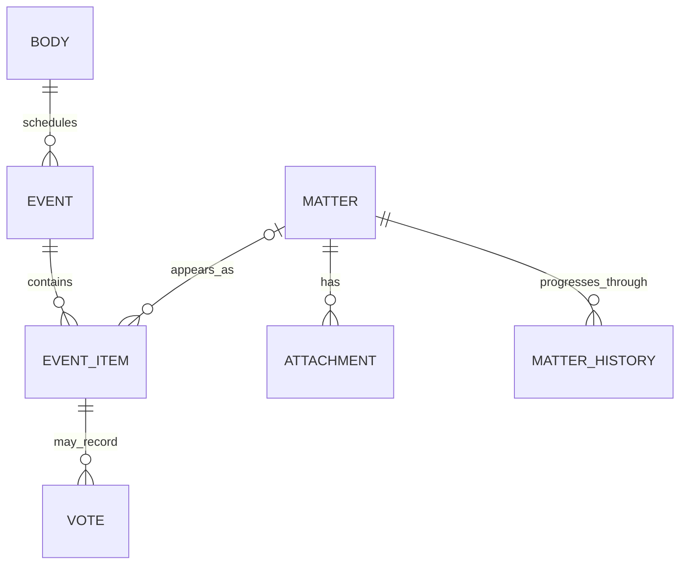
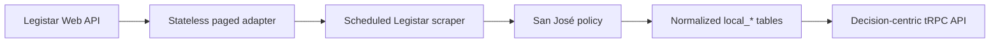

# Local Government Decisions and Legistar

> Status: Backend foundation implemented
>
> Initial jurisdiction: City of San José
> Tracking issue: [#282](https://github.com/billion-app/billion/issues/282)

Legistar is a records-management system, not a feed of interchangeable “local
bills.” A proposal can appear before several bodies and at several meetings,
while the agenda item, attachments, minutes, and vote endpoint each describe a
different part of its lifecycle. Billion therefore treats Legistar as a source
adapter behind a source-neutral local-government model.

## Source model and identity

- A **Body** is a council, committee, board, commission, or hearing body.
- An **Event** is a meeting and owns its time, location, agenda, minutes, and
  video links.
- An **EventItem** is one occurrence on a meeting agenda. Meeting-specific
  action, tally, mover, seconder, and votes belong here.
- A **Matter** is the proposal or file. The same Matter can appear at multiple
  meetings, so it is the canonical decision identity but not the occurrence.
- An **Attachment** is an official document or link associated with a Matter.

The normalized model separates `local_decision` (one source Matter) from
`local_meeting_item` (one EventItem occurrence). This supports one decision
card with a truthful multi-meeting timeline. Similar titles never merge records.

## Implemented architecture

The transport in `packages/api/src/integrations/legistar.ts` performs bounded,
paged source reads and has no cache, mock fallback, or database side effects.
The registered `legistar` scraper:

1. discovers meetings in a bounded past/future window;
2. restricts them to the explicit San José body policy;
3. fetches complete EventItems, Matters, attachments, histories, and votes;
4. classifies boilerplate, topics, geography, and document policy;
5. extracts native PDF text and hashes official documents;
6. idempotently upserts records and soft-deletes disappeared meetings,
   occurrences, and attachments;
7. records each run, its window, counters, failure, and completion state.

The default window is 45 days back and 120 days forward. Operators can tune the
window, item cap, document-size ceiling, and extraction through `LEGISTAR_*`
variables. A capped run never treats unvisited meetings as deleted.

### Storage

The old unused `legistar_*` cache tables are replaced by:

| Table                     | Purpose                                       |
| ------------------------- | --------------------------------------------- |
| `local_jurisdiction`      | Adapter and public portal identity            |
| `local_body`              | Source bodies plus inclusion/relevance policy |
| `local_decision`          | Canonical Matter, topic, dates, and geography |
| `local_meeting`           | Event schedule and official artifact links    |
| `local_meeting_item`      | Matter occurrence and outcome fields          |
| `local_decision_document` | Attachment policy, hash, and extracted text   |
| `local_decision_history`  | Structured Matter history when published      |
| `local_decision_vote`     | Named structured votes when published         |
| `local_ingestion_run`     | Window, status, counters, and errors          |

All foreign keys are indexed. Raw payloads and source modification times are
retained. Source removals are recorded rather than hard-deleted. Row-level
security is enabled on every new public-schema table without anon or
authenticated policies; access is through the server API.

### Read API

- `legistar.listDecisions`: upcoming/recent occurrences, text search, topic,
  district relevance, and pagination.
- `legistar.getDecision`: canonical detail, timeline, documents, history,
  votes, public-comment count, and participation guidance.
- `legistar.listBodies`: included active bodies in editorial priority order.
- `legistar.getIngestionHealth`: latest run and active-decision count.

Old wire-format endpoints remain temporarily for dormant prototype callers.
They are deprecated, read-only source calls and are not the new UI contract.

## San José first-release policy

Live discovery in August 2026 confirmed unauthenticated reads and a large,
mixed body list. EventItems contain both actual Matters and procedural rows.
Attachments include staff memoranda, ordinances, resolutions, presentations,
supplements, and public letters. Sampled completed meetings often had sparse
structured histories and votes, so missing structured data means “unknown,”
never “no action.”

### Included bodies

The release uses three editorial tiers:

1. City Council and the six standing policy committees.
2. High-impact resident-facing bodies, including Planning, Housing, Historic
   Landmarks, Appeals, Airport, Bicycle/Pedestrian, Climate, and oversight.
3. Community and quality-of-life bodies, including Arts, Civil Service,
   Senior Citizens, Youth, Privacy, Smart City, and Small Business.

Closed session, notice-only, miscellaneous, internal administrative, and
employee-benefit bodies are excluded. Exact IDs live in
`apps/scraper/src/scrapers/legistar-policy.ts`. The boundary favors decisions
affecting residents’ money, housing, mobility, safety, services, rights, land
use, or participation.

### Geography

Scope is conservative. Explicit district references produce district scope;
explicit addresses produce place scope; only explicit citywide language
produces citywide scope. An absent district remains `unknown`. District items
may rank above citywide items, but citywide decisions should not be hidden.

### Documents and OCR

A sampled 39-page memorandum contained about 127,000 characters of embedded
text and a 14-page presentation about 17,000. A sampled one-page public letter
had no embedded text. Therefore:

- official PDFs use native extraction first;
- fewer than 80 extracted characters per page marks `ocr_required`;
- public-comment documents are link-only and never enter OCR or indexing;
- OCR publication should require at least 98% sampled character accuracy (or
  equivalent high-confidence validation);
- OCR must not be the sole evidence for votes, money, deadlines, or addresses.

The current implementation detects and records OCR work; the OCR worker is a
follow-up. Native extraction against live PDFs produced 379,761 characters
across 19 documents with an average quality score of 0.9947.

## Public-comment privacy decision

Public-comment letters matter because they show resident engagement and form
part of the official record. They can also expose names, signatures, home
addresses, email addresses, phone numbers, medical circumstances, immigration
details, or other information submitted for a specific civic purpose.

For the first release Billion shows the official link and aggregate document
count, but does not download, OCR, index, quote, summarize, classify, or build
profiles from individual letters. Public availability is not the same as
consent to make scattered personal details newly searchable or send them to an
AI provider. Aggregate sentiment could be reconsidered only with redaction,
minimum-group thresholds, provenance, and a dedicated privacy review.

## Evidence, outcomes, and participation

Fact precedence is field-specific:

1. structured action/vote data for that EventItem;
2. approved official minutes;
3. amended agenda, agenda, or staff memorandum;
4. other official attachments and meeting pages;
5. official video/transcript as context only.

Missing votes/history remain unknown. AI-authored explanations require
validated citations and must not infer a vote from attendance or sentiment.
The backend retains the source material for this layer but does not publish AI
summaries yet. Page-aware citations, minutes fallback, and generation remain
quality-gated follow-ups rather than silently shipping uncited text.

The API currently provides a labeled San José participation fallback link and
warns readers to verify the agenda. A future extractor should prefer current
meeting-specific instructions, method, explicit deadline/timezone, item
identifier, and retrieval time. Never manufacture a deadline.

## Operations and failure behavior

- Production never substitutes synthetic records for failed source reads.
- Pagination and retries are bounded.
- Every run records its complete query window and result.
- Last-known records survive transient failures.
- Retrieval, extraction, and deletion are separate states.
- Public reads exclude soft-deleted records.
- Fixtures and policy tests run offline.

Recommended cadence is daily broad discovery, every six hours within 14 days,
hourly within 48 hours, and continued refresh after meetings until approved
outcomes publish. Scheduler wiring can apply this without changing the scraper.

## Decisions and remaining work

Decisions made here:

- canonical card = Matter; each hearing/reading = timeline occurrence;
- explicit three-tier body allowlist based on resident impact;
- native extraction first, with deterministic OCR and acceptance gates;
- public letters remain links/counts but are excluded from AI/text processing;
- conservative geography with `unknown` as a valid state;
- normalized source-neutral schema instead of unused cache tables;
- no mock fallback and no uncited AI summaries.

Remaining product-quality work:

- approved-minutes extraction and page-level citations;
- OCR worker and measured validation set;
- agenda-specific participation extraction;
- official GIS resolution for addresses and user districts;
- cited AI explanations and amended-recommendation comparison;
- measured “outcome pending” thresholds;
- validation against a second jurisdiction before generalizing policy.
