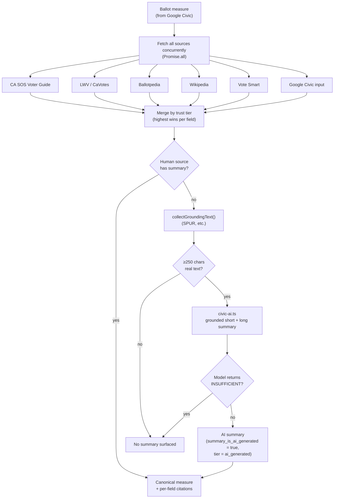

# Ballot-Measure Enrichment

How `civic.getVoterInfo` turns the bare measure titles Google Civic returns into fully attributed measure cards: summary, fiscal impact, pro/con arguments, and per-field citations.

## The problem

The Google Civic Information API reliably returns ballot-measure **titles** but almost never populates the content fields (subtitle, pro/con, fiscal impact, full text) — especially for local (city/county) measures. The expanded measure cards in the app were therefore mostly empty. All of this data is **public record**; paid aggregators (Ballotpedia, BallotReady, Democracy Works) just structure it. So instead of paying for a thin API, we combine several free, official sources and cross-validate them. There is **no national clearinghouse** for measure content — it's a state-and-local matter, which is why coverage is built up state by state.

## Engine + entry point

- **Engine:** `packages/api/src/lib/measure-crossvalidate.ts`
- **Source adapters:** `packages/api/src/lib/measure-sources/`
- **Entry point:** `enrichContest()` in `packages/api/src/lib/civic.ts`, run by `civic.getVoterInfo`.

```
CA SOS Official Voter Guide  ─┐
LWV CaVotes (Pros & Cons)    ─┤
Ballotpedia (statewide+local)─┤
Wikipedia (statewide props)  ─┼──▶ Cross-Validation Engine ──▶ Canonical Measure ──▶ Cache (CivicApiCache) ──▶ App
Vote Smart API               ─┤        │ merge by trust tier        │ citation on every field
Google Civic API             ─┤        │ AI structures, never authors
SPUR + AI (grounded fallback)─┘        └── flags discrepancies for review
```

The engine fetches all sources concurrently (`Promise.all`) and merges them **field-by-field by trust tier** — the highest-tier source holding a field wins it and is cited.

**Principles:** official sources win field conflicts; every surfaced field carries a citation; AI structures and reconciles but never invents.

## Trust tiers

When more than one source covers the same field, the higher tier wins (defined in `measure-sources/types.ts`, `SOURCE_TIER_RANK`):

```
county_registrar > state_sos > lwv > ballotpedia > wikipedia > vote_smart > google_civic > ai_generated
```

## Source adapters (wired today)

Each adapter fetches over a shared, defensive helper (`measure-sources/fetch.ts`) that uses a browser User-Agent and turns any failure into `null`.

| Source                           | Adapter                | Tier           | Scope / method                                                                                                                                                                                                                                                                                                                                                                 |
| -------------------------------- | ---------------------- | -------------- | ------------------------------------------------------------------------------------------------------------------------------------------------------------------------------------------------------------------------------------------------------------------------------------------------------------------------------------------------------------------------------ |
| CA SOS Official Voter Guide      | `ca-sos-voterguide.ts` | `state_sos`    | CA statewide props. Official AG summary, pro/con, full-text URL — **real official text, not AI.** Matches on the prop number parsed from the title. The guide is rebuilt each cycle and only serves the active election, so it yields nothing between prop cycles.                                                                                                             |
| CA LAO Fiscal Analyses           | `ca-lao-fiscal.ts`     | `state_sos`    | CA statewide props. Official nonpartisan fiscal impact analysis for each proposition. HTML scrape of `lao.ca.gov/BallotAnalysis/Proposition?number=N&year=YYYY` — no API exists. Pre-warmed by the `ca-lao-fiscal` scraper into `CivicApiCache`; adapter reads cache first, falls back to live fetch. Only fires for parsed proposition numbers (not local lettered measures). |
| League of Women Voters — CaVotes | `cavotes.ts`           | `lwv`          | CA statewide props. Nonpartisan "Pros & Cons" summary, fiscal effects, supporter/opponent arguments via the CaVotes WordPress REST API (`cavotes.org/wp-json/wp/v2/ballots`). Slugs are inconsistent across years, so it enumerates the list and matches by prop number + year.                                                                                                |
| Ballotpedia                      | `ballotpedia.ts`       | `ballotpedia`  | **Statewide _and_ local** lettered measures — the main source for local. Rendered article HTML (MediaWiki API disabled), resolved from a year/county index. Extracts ballot summary/question, fiscal impact / impartial analysis, arguments. Year-gated so a same-letter measure from another cycle isn't surfaced.                                                            |
| Wikipedia                        | `wikipedia.ts`         | `wikipedia`    | CA statewide props only — gated on a parsed prop number (local titles like "Measure Q" collide with unrelated articles). MediaWiki extract for `<year> California Proposition <n>`; neutral encyclopedic overview.                                                                                                                                                             |
| Vote Smart                       | `votesmart.ts`         | `vote_smart`   | State-level measures. Fuzzy-matches the title to a Vote Smart measure → summary, full-text URL, pro/con URLs. Requires `VOTE_SMART_API_KEY`.                                                                                                                                                                                                                                   |
| Google Civic                     | (the input itself)     | `google_civic` | The measure as the API returned it — lowest-trust, so its subtitle/text still surface when nothing better exists.                                                                                                                                                                                                                                                              |

**Local lettered measures:** the County Counsel / City Attorney **Impartial Analysis** (carried on Ballotpedia) is extracted on its own and wins the summary slot ahead of the bare ballot question — it's the authoritative neutral text, so it no longer gets buried in the fiscal field, and the advocacy/AI fallback only runs when it's absent.

## Grounded AI fallback (`grounded-fallback.ts`)

- **When:** no human/aggregator source had a summary.
- **What:** resolves the measure on SPUR's Bay Area voter guide (`spur.org/voter-guide/<YYYY>-<MM>`) by its letter and fetches the real page text. That text — never the title alone — is what the AI summarizes (`civic-ai.ts` produces a 1-sentence short summary and a 3-4 sentence long summary, plus pro/con, grounded strictly in the fetched text). The summary is flagged AI-generated and cites the SPUR page it was built from.
- **Bias control:** SPUR is party-independent but _not_ neutral — it takes an explicit YES/NO position on every measure. We strip its "SPUR's Recommendation" section before grounding, and the AI prompt is instructed to ignore advocacy framing, so the endorsement never leaks into the neutral summary.
- **Pro/con:** SPUR pages carry "Pros"/"Cons" lists; those are parsed and surfaced directly, cited to SPUR at the `ai_generated` (last-resort) tier — they are SPUR's framing, not the nonpartisan League tier. AI pro/con is generated only when no source supplied any.
- **Grounding gate:** generation only proceeds with ≥250 chars of real source text, and the prompt returns an `INSUFFICIENT` sentinel (→ result discarded, no summary surfaced) if that text doesn't actually describe the measure — so the model can't fabricate from a title.

## AI's role (explicitly scoped)

- **YES** — summarize official fiscal-impact analyses into plain language; reconcile and structure existing source text.
- **NO** — invent a summary or arguments when no source material exists (the UI shows "No information available"). AI pro/con is allowed only as a grounded last resort, flagged AI-generated.
- **Fallback only** — when there _is_ fetched source text but no human summary, an AI summary is generated and **flagged** (`Contest.summaryIsAiGenerated`) so the app labels it "AI-generated — not from an official source", and cited at tier `ai_generated`. Generation goes through the generic `llm` provider (`ai-provider.ts`): Groq by default, then OpenRouter, OpenAI, and deprecated direct DeepSeek.



## Output shape

`crossValidateMeasure` returns a `CanonicalMeasure`, mapped onto the existing `Contest` type:

| Field                               | Meaning                                                                             |
| ----------------------------------- | ----------------------------------------------------------------------------------- |
| `summary`                           | best available summary (official preferred)                                         |
| `summaryShort` / `summaryLong`      | one-sentence card preview / fuller detail-screen summary                            |
| `summaryIsAiGenerated`              | true if `summary` came from AI                                                      |
| `fiscalImpact`                      | official fiscal analysis                                                            |
| `proArguments[]` / `conArguments[]` | attributed arguments (`{text, author?, sourceName, sourceUrl}`)                     |
| `citations[]`                       | which source supplied each field (`{field, sourceName, sourceUrl, tier, official}`) |
| `sources[]`                         | one `Source` per citation, for attribution chips                                    |

The same columns exist on `ContestRecord` (`summaryIsAiGenerated`, `fiscalImpact`, `citations`) so persisted measures keep their attribution.

## Robustness

Every scraper is **defensive**: network failures, timeouts, and markup changes yield `null`, never a throw. A missing source is simply "no data from this tier", and the engine merges whatever it got. Worst case, the app falls back to the raw Google Civic data exactly as before. Enrichment is expensive (network + AI), so results ride along inside the `civic.getVoterInfo` response, cached per-address in `CivicApiCache` with a 24h TTL — no separate cache table.

## Source roadmap — extending beyond California

The source-adapter interface (`MeasureSourceData`) is generic, so the **source set grows without touching the engine**: write an adapter returning `MeasureSourceData | null`, assign it a `SourceTier`, and register it in the `Promise.all` in `crossValidateMeasure`. The premise (from `docs/research/api-pricing-and-incorporation-2026.md`): measure content is public record, so we ingest free official/civic sources state by state. California is by far the most data-rich state in machine-readable form, hence CA-first.

**Planned sources** (researched, tracked in the [Outreach Tracker](https://github.com/orgs/billion-app/projects/3) under the _Data Source_ track — **not yet built**; [outreach-deliverables.md](./outreach-deliverables.md) §4 defines "done" per source):

| Source                                           | Adds                                                                                  | Access                                   | Outreach?           |
| ------------------------------------------------ | ------------------------------------------------------------------------------------- | ---------------------------------------- | ------------------- |
| **CA SOS Results API**                           | Vote counts for all CA measures (JSON/CSV)                                            | Free, no auth                            | No                  |
| **CA SOS VIG Archive**                           | Full prop text + pro/con + rebuttals, 1996–present                                    | Free (HTML; live site 403s, use archive) | Permission ask      |
| ~~**LAO**~~                                      | ✅ **Shipped** — see `measure-sources/ca-lao-fiscal.ts` + `scrapers/ca-lao-fiscal.ts` | Free, HTML scrape (no API)               | No                  |
| **SF DataSF**                                    | SF propositions 1907–present (Socrata API) — _local schema template_                  | Free API                                 | No                  |
| **CEDA** (CSU Sacramento)                        | CA **local** measures + text, 1995–present                                            | Free, Excel/PDF                          | Bulk-export request |
| **NCSL**                                         | National metadata (50 states, 1902–present) — type/topic/pass-fail, **no text**       | Free (Power BI / CSV)                    | CSV-export request  |
| **OpenElections**                                | Precinct-level results across states (CSV on GitHub)                                  | Free                                     | Licensing confirm   |
| **VIP / Voting Info Project**                    | 40+ states ballot content (VIP spec v6.0)                                             | Request (feeds not public)               | Partnership         |
| **Florida / Oregon / Colorado / NY / Texas SOS** | Per-state measure text/results                                                        | Free (HTML/PDF/XLSX)                     | Mostly no           |

**Phasing** (CA-first):

1. **Phase 1 — CA core:** CA SOS Results API + ~~LAO~~ ✅ + VIG Archive + SF DataSF. Mostly no outreach; proves out the pipeline on the richest single-state dataset.
2. **Phase 2 — national results layer:** NCSL metadata + OpenElections, combined for a national results picture.
3. **Phase 3 — other states:** Florida, Oregon, etc. — add per-state adapters as bandwidth allows.
4. **Phase 4 — CA local:** CEDA for county/city/school-district measures.

Outreach-gated sources (CEDA, NCSL, VIP) follow the same code path once access is granted — a data-access request just precedes the build. **Risk mitigations baked into source design:** scrapers tag the source-structure version they target; 403-prone sites (live VIG) fall back to archived versions plus politeness delays; PDF-only states (FL, TX) use `pdfminer`/`pdfplumber` and are deprioritized; government data has no SLA, so results are cached aggressively with last-fetched timestamps. CEDA historical data can validate extraction accuracy.
