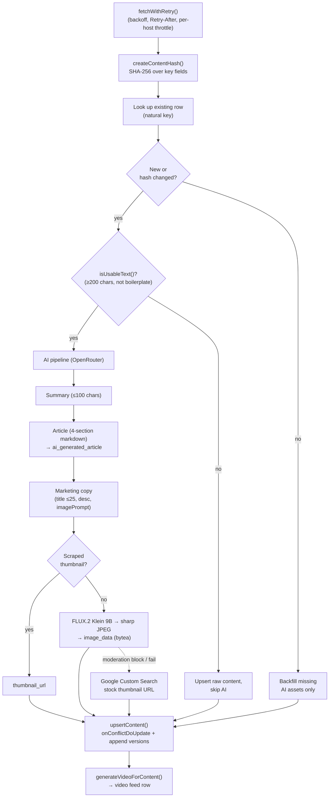

# Scraper Pipeline

## Overview

`apps/scraper/` is a standalone Node.js process. It runs on demand or on a schedule and writes **directly to the database** via `@acme/db` — no HTTP, no tRPC, no auth. It's a trusted server-side process; routing writes through tRPC would add latency, require tokens, and force write endpoints to be secured for no benefit.

Invoke via CLI: `pnpm start [scraper|all] [--concurrency N]` (default
concurrency 3, via `p-limit`). From the repo root, use
`pnpm --filter @acme/scraper run start [scraper] --concurrency N`. It ships
as a multi-stage `Dockerfile.scraper` (Node 22-slim). Vite builds the Node ESM
production entries, bundles linked workspace source, and leaves ordinary
runtime dependencies external for the production install. The container starts
the CLI with `node dist/main.js`; production configuration is read from the
process environment at runtime, not embedded during the build.

## Scrapers

| Scraper                     | Source                           | Content type               | Method                                                                  |
| --------------------------- | -------------------------------- | -------------------------- | ----------------------------------------------------------------------- |
| `congress.ts`               | congress.gov REST API            | `bill`                     | REST (`CONGRESS_API_KEY`), incremental by `updateDate`                  |
| `federalregister.ts`        | federalregister.gov REST API     | `government_content`       | REST; HTML→Markdown via Turndown                                        |
| `scotus.ts`                 | CourtListener REST API           | `court_case`               | REST (`COURTLISTENER_API_KEY`, optional)                                |
| `vote411.ts`                | vote411.org                      | (cached locally)           | cheerio HTML parse; does **not** write to the main DB                   |
| `scc-cvig.ts`               | Santa Clara County voter guide   | `civic_api_cache`          | PDF extraction; optional Gemini fallback                                |
| `ca-sos-statements.ts`      | CA Secretary of State guide      | `civic_api_cache`          | official candidate-statement pages                                      |
| `ca-lao-fiscal.ts`          | CA LAO ballot analyses           | `civic_api_cache`          | proposition fiscal analyses via HTML parse                              |
| `ca-vig-archive.ts`         | CA SOS voter-guide archive       | `civic_api_cache`          | historical proposition guide pages via HTML parse                       |
| `texas-current-election.ts` | Texas SOS + TLC                  | `election_source_snapshot` | current-cycle JSON + deterministic PDF text parsing                     |
| `texas-legislature.ts`      | Texas Legislative Council FTP    | `bill`                     | current-session XML + bulk HTML; no site mining                         |
| `missouri-legislature.ts`   | Missouri House XML exports       | `bill`                     | active sessions; Senate coverage is House-actions-only                  |
| `civicengage.ts`            | Cedar Park official council page | local-government tables    | CivicEngage entry page + Municode embed; deterministic HTML/PDF parsing |
| `durham-onbase.ts`          | Durham OnBase Agenda Online      | local-government tables    | current-cycle meetings, items, attachments, and official actions        |
| `durham-bocc.ts`            | Durham County Legistar API       | local-government tables    | current-cycle meetings, items, actions, votes, and documents            |

All HTTP goes through one `fetchWithRetry()` utility (`apps/scraper/src/utils/fetch.ts`): exponential backoff (1s/2s/4s…), `Retry-After` support (seconds or HTTP-date), 30s default timeout via `AbortController`, retriable on 429/5xx and `ECONNRESET`/`ECONNREFUSED`, plus a stateful **per-host backoff** that ramps on 429/5xx and relaxes on success.

> Note: `whitehouse.gov` cheerio scraping was replaced by the structured **Federal Register** REST API. `vote411-ballot.ts` exists for address-based ballot lookup (needs Playwright) but isn't wired into the CLI.

The Texas scraper is intentionally current-cycle only. SOS election facts and
TLC explanatory text remain separate provider snapshots and separate citations;
see [Texas current-election data](./texas-current-election.md).

The Cedar Park pilot is deliberately limited to City Council meetings from the
latest 12 months. It stores meetings, versioned documents, agenda items,
motions/outcomes, and named roll-call votes in provider-neutral tables. It does
not browse or backfill historical election cycles.

### Durham OnBase

Run `pnpm -F @acme/scraper start:dev -- durham-onbase`. The scraper reads the
official OnBase embedded meeting JSON, agenda/minutes HTML outlines, and agenda
item detail endpoints. It does not use AI or PDF vision. Requests are serialized
at a minimum 250 ms interval, use the shared retry/backoff client, and skip rows
refreshed in the last 24 hours by default.

Only meetings in the current calendar-year council cycle are ingested. The
product does not expose historical election cycles or run an OnBase backfill.
`DURHAM_ONBASE_MAX_ITEMS` (default `100`) limits meetings and
`DURHAM_ONBASE_CACHE_TTL_HOURS` (default `24`) controls refresh frequency.

### Durham County BOCC

`durham-bocc` reads Durham County's official structured Legistar feed for BOCC body ID `138`. It bounds discovery to the current two-year election cycle, upserts stable provider IDs, and stores checksums/source row versions so replaced agendas update the existing meeting. Cancellations and explicit amendments remain visible; Spanish attachments are tagged separately. Agenda/minutes PDFs are retained as official links and are not sent through AI or OCR when structured item/action fields are available.

Run it with `pnpm --filter @acme/scraper run start durham-bocc`. The default cap is 100 meetings and can be changed with `DURHAM_BOCC_MAX_ITEMS` or `--max-items`.

## Upsert + Change Detection

`apps/scraper/src/utils/db/operations.ts` centralizes writes behind a discriminated-union `upsertContent(type, data)` (`type` ∈ bill | government_content | court_case). Each run:

1. Compute a SHA-256 over the type-specific key fields (title, summary, full text, status…).
2. Look up the existing row by its natural key (`(billNumber, sourceWebsite, legislativeSession)`, `url`, or `caseNumber`).
3. **Unchanged hash** → skip AI entirely; backfill only missing AI assets.
4. **New bill without a source description** → generate the required description first; defer the insert if source text or every provider is unavailable.
5. **New or changed** → run the remaining AI pipeline, upsert via `onConflictDoUpdate`, append to `versions`.

`SCRAPER_FORCE_AI_REGEN=1` overrides the cache. A `isUsableText()` gate refuses to feed AI any text under 200 chars or that's mostly blank/all-caps/single-word lines — keeps the model from "summarizing" garbage.

Texas is the provider-neutral state-bill extension to this flow. Its rows carry
an OCD jurisdiction, legislative session, subjects, sponsorships, documents,
votes, and an optional exact Open States ID. The scraper selects only the latest
FTP session and sets `skipEnrichment`; the API exposes only that newest session
through `content.texasBills`, with full supporting material in `content.getById`.

Missouri uses the same rows and `content.stateBills` reader. Active session
codes come from the official
[`SessionSet.js`](https://documents.house.mo.gov/SessionSet.js);
[`BillList.XML` fields](https://documents.house.mo.gov/XMLBillList.html),
including `LastTimeRun`, drive
individual XML change detection. A `CivicApiCache` refresh lease enforces the
official 30-minute minimum interval, and fetch concurrency is capped at two.
Senate rows come only from `SenateActList.XML` and retain the explicit
`senate_with_house_actions_only` coverage marker in `bill.versions`.
The [official export guidance](https://documents.house.mo.gov/) documents the
hourly generation schedule and the 30-minute minimum polling interval.

## AI Pipeline

Provider config lives in `apps/scraper/src/utils/ai/provider.ts`: text uses **OpenRouter** first, then an OpenAI-compatible local endpoint (`LOCAL_LLM_BASE_URL`, such as Ollama), with direct DeepSeek retained only as a deprecated last resort. PDF vision fallback uses **Gemini `gemini-2.5-flash`**. Images use hosted **Black Forest Labs FLUX.2 Klein 9B**, then `LOCAL_FLUX_BASE_URL` as a local fallback. Provider usage and hosted-image costs are tracked per run.

Each new/changed item runs through:

1. **Summary** (`text-generation.ts`) — ≤100-char punchy summary, 8th-grade reading level.
2. **Article** (`text-generation.ts`) — structured 4-section markdown: _What This Means For You_, _Overview_, _Impact & Implications_, _The Debate_; balanced across perspectives. Stored in `ai_generated_article`. Throws a typed `AIRateLimitError` on 429.
3. **Marketing copy** (`marketing-generation.ts`) — Zod-validated `{ title ≤25 chars, description ≤25 words, imagePrompt }` for the `video` feed card.
4. **Imagery** — multiple sources:
   - _Scraped thumbnail_ (preferred, free): source-provided image URL → `thumbnail_url`.
   - _Generated_: hosted FLUX.2 Klein 9B produces a 1024×1024 image, falling back to the configured local FLUX server at 768×768; `sharp` converts PNG→JPEG (q85); bytes land in the `image_data` `bytea` column. Hosted calls retry with backoff; moderation blocks return `null` silently.
   - _Stock-photo fallback_: `image-keywords.ts` → Google Custom Search (`GOOGLE_API_KEY` + `GOOGLE_SEARCH_ENGINE_ID`) can supply a thumbnail URL.

New bills that need an AI description generate it before the initial insert. A
provider outage therefore leaves the source item eligible for the next scrape
instead of persisting an incomplete bill that requires a manual repair.

## Pipeline Flow

The SHA-256 gate is the main cost control: unchanged content skips every AI call.

