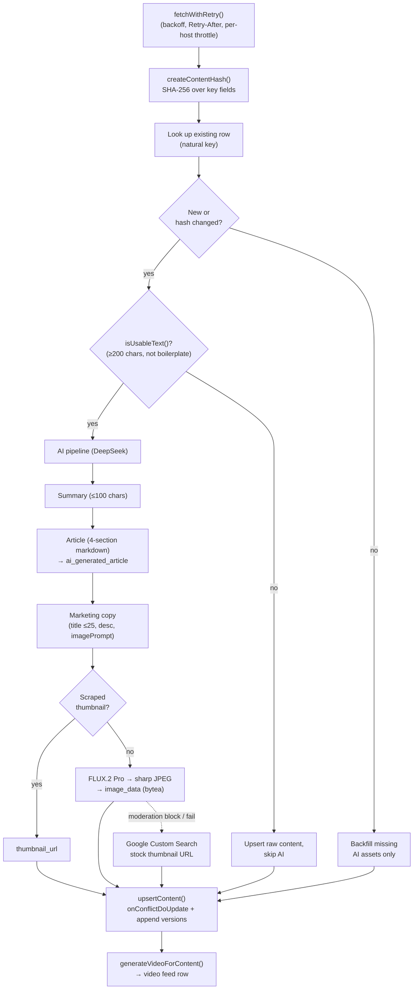

# Scraper Pipeline

## Overview

`apps/scraper/` is a standalone Node.js process. It runs on demand or on a schedule and writes **directly to the database** via `@acme/db` — no HTTP, no tRPC, no auth. It's a trusted server-side process; routing writes through tRPC would add latency, require tokens, and force write endpoints to be secured for no benefit.

Invoke via CLI: `pnpm start [scraper|all] [--concurrency N]` (default
concurrency 3, via `p-limit`). From the repo root, use
`pnpm --filter @acme/scraper run start -- [scraper] --concurrency N`. It ships
as a multi-stage `Dockerfile.scraper` (Node 20-slim) that builds `@acme/db` +
the scraper, rewrites package exports to `dist/`, and runs `node dist/main.js`.

## Scrapers

| Scraper                | Source                         | Content type         | Method                                                 |
| ---------------------- | ------------------------------ | -------------------- | ------------------------------------------------------ |
| `congress.ts`          | congress.gov REST API          | `bill`               | REST (`CONGRESS_API_KEY`), incremental by `updateDate` |
| `federalregister.ts`   | federalregister.gov REST API   | `government_content` | REST; HTML→Markdown via Turndown                       |
| `scotus.ts`            | CourtListener REST API         | `court_case`         | REST (`COURTLISTENER_API_KEY`, optional)               |
| `vote411.ts`           | vote411.org                    | (cached locally)     | cheerio HTML parse; does **not** write to the main DB  |
| `scc-cvig.ts`          | Santa Clara County voter guide | `civic_api_cache`    | PDF extraction; optional Gemini fallback               |
| `ca-sos-statements.ts` | CA Secretary of State guide    | `civic_api_cache`    | official candidate-statement pages                     |
| `ca-lao-fiscal.ts`     | CA LAO ballot analyses         | `civic_api_cache`    | proposition fiscal analyses via HTML parse             |
| `ca-vig-archive.ts`    | CA SOS voter-guide archive     | `civic_api_cache`    | historical proposition guide pages via HTML parse      |
| `fl-dos-initiatives.ts` | Florida Division of Elections | `civic_api_cache`    | permission-gated HTML tracking + full-text PDF extraction |
| `spur-voter-guide.ts`   | SPUR Bay Area voter guide     | `civic_api_cache`    | attributed background, equity, pro/con, and recommendation HTML |
| `ca-governor-eos.ts`    | California Governor           | `government_content` | paginated HTML discovery + signed-PDF extraction                 |

All HTTP goes through one `fetchWithRetry()` utility (`apps/scraper/src/utils/fetch.ts`): exponential backoff (1s/2s/4s…), `Retry-After` support (seconds or HTTP-date), 30s default timeout via `AbortController`, retriable on 429/5xx and `ECONNRESET`/`ECONNREFUSED`, plus a stateful **per-host backoff** that ramps on 429/5xx and relaxes on success.

> Note: `whitehouse.gov` cheerio scraping was replaced by the structured **Federal Register** REST API. `vote411-ballot.ts` exists for address-based ballot lookup (needs Playwright) but isn't wired into the CLI.

## Upsert + Change Detection

`apps/scraper/src/utils/db/operations.ts` centralizes writes behind a discriminated-union `upsertContent(type, data)` (`type` ∈ bill | government_content | court_case). Each run:

1. Compute a SHA-256 over the type-specific key fields (title, summary, full text, status…).
2. Look up the existing row by its natural key (`(billNumber, sourceWebsite)`, `url`, or `caseNumber`).
3. **Unchanged hash** → skip AI entirely; backfill only missing AI assets.
4. **New or changed** → run the AI pipeline, upsert via `onConflictDoUpdate`, append to `versions`.

`SCRAPER_FORCE_AI_REGEN=1` overrides the cache. A `isUsableText()` gate refuses to feed AI any text under 200 chars or that's mostly blank/all-caps/single-word lines — keeps the model from "summarizing" garbage.

## AI Pipeline

Provider config lives in `apps/scraper/src/utils/ai/provider.ts`: text via **DeepSeek `deepseek-v4-flash`** (Vercel AI SDK), images via **Black Forest Labs FLUX.2 Pro**. Token and image costs are tracked per run.

Each new/changed item runs through:

1. **Summary** (`text-generation.ts`) — ≤100-char punchy summary, 8th-grade reading level.
2. **Article** (`text-generation.ts`) — structured 4-section markdown: _What This Means For You_, _Overview_, _Impact & Implications_, _The Debate_; balanced across perspectives. Stored in `ai_generated_article`. Throws a typed `AIRateLimitError` on 429.
3. **Marketing copy** (`marketing-generation.ts`) — Zod-validated `{ title ≤25 chars, description ≤25 words, imagePrompt }` for the `video` feed card.
4. **Imagery** — multiple sources:
   - _Scraped thumbnail_ (preferred, free): source-provided image URL → `thumbnail_url`.
   - _Generated_: FLUX.2 Pro produces a 1024×1024 image from the marketing image prompt; `sharp` converts PNG→JPEG (q85); bytes land in the `image_data` `bytea` column. Up to 3 retries with backoff; moderation blocks return `null` silently.
   - _Stock-photo fallback_: `image-keywords.ts` → Google Custom Search (`GOOGLE_API_KEY` + `GOOGLE_SEARCH_ENGINE_ID`) can supply a thumbnail URL.

> The earlier design used **Gemini for text and DALL-E/Imagen for images**; both were replaced (DeepSeek for cost/quality on text, FLUX.2 Pro for images).

## Pipeline Flow

The SHA-256 gate is the main cost control: unchanged content skips every AI call.

