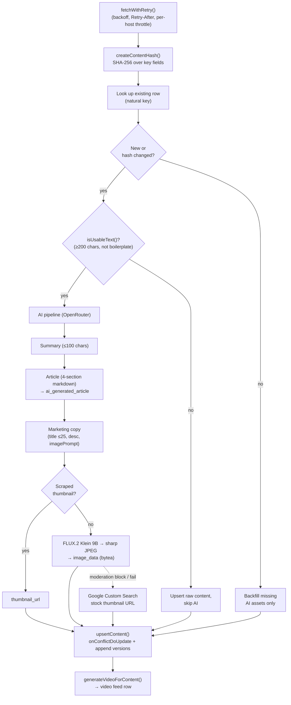

# Scraper Pipeline

## Overview

`apps/scraper/` is a standalone Node.js process. It runs on demand or on a schedule and writes **directly to the database** via `@acme/db` — no HTTP, no tRPC, no auth. It's a trusted server-side process; routing writes through tRPC would add latency, require tokens, and force write endpoints to be secured for no benefit.

Invoke via CLI: `pnpm start [scraper|all] [--concurrency N]` (default
concurrency 3, via `p-limit`). From the repo root, use
`pnpm --filter @acme/scraper run start [scraper] --concurrency N`. It ships
as a multi-stage `Dockerfile.scraper` (Node 22-slim). Vite builds the Node ESM
production entries, bundles linked workspace source, and leaves ordinary
runtime dependencies external for the production install. The container starts
the CLI with `node dist/main.js`; production configuration is read from the
process environment at runtime, not embedded during the build.

## Scrapers

| Scraper                | Source                         | Content type         | Method                                                                                                                          |
| ---------------------- | ------------------------------ | -------------------- | ------------------------------------------------------------------------------------------------------------------------------- |
| `congress.ts`          | congress.gov REST API          | `bill`               | REST (`CONGRESS_API_KEY`), incremental by source `updateDate` — see [Incremental discovery](#incremental-discovery-congressgov) |
| `federalregister.ts`   | federalregister.gov REST API   | `government_content` | REST; HTML→Markdown via Turndown                                                                                                |
| `scotus.ts`            | CourtListener REST API         | `court_case`         | REST (`COURTLISTENER_API_KEY`, optional)                                                                                        |
| `vote411.ts`           | vote411.org                    | (cached locally)     | cheerio HTML parse; does **not** write to the main DB                                                                           |
| `scc-cvig.ts`          | Santa Clara County voter guide | `civic_api_cache`    | PDF extraction; optional Gemini fallback                                                                                        |
| `ca-sos-statements.ts` | CA Secretary of State guide    | `civic_api_cache`    | official candidate-statement pages                                                                                              |
| `ca-lao-fiscal.ts`     | CA LAO ballot analyses         | `civic_api_cache`    | proposition fiscal analyses via HTML parse                                                                                      |
| `ca-vig-archive.ts`    | CA SOS voter-guide archive     | `civic_api_cache`    | historical proposition guide pages via HTML parse                                                                               |

All HTTP goes through one `fetchWithRetry()` utility (`apps/scraper/src/utils/fetch.ts`): exponential backoff (1s/2s/4s…), `Retry-After` support (seconds or HTTP-date), 30s default timeout via `AbortController`, retriable on 429/5xx and `ECONNRESET`/`ECONNREFUSED`, plus a stateful **per-host backoff** that ramps on 429/5xx and relaxes on success.

> Note: `whitehouse.gov` cheerio scraping was replaced by the structured **Federal Register** REST API. `vote411-ballot.ts` exists for address-based ballot lookup (needs Playwright) but isn't wired into the CLI.

## Incremental discovery (congress.gov)

Each run walks the congress.gov bill feed forward from a stored cursor. Three
properties matter, and each exists because its absence caused a real outage:

**The cursor is the source's clock, not ours.** `scraper_cursor` holds the
`updateDate` of the newest bill we have _durably written_, keyed
`congress:{congress}`. It used to be `max(Bill.updatedAt)` — the time we last
wrote a row — passed to the API as `fromDateTime`, which filters on
congress.gov's clock. Comparing two unrelated clocks meant every bill a run
fetched but did not persist fell behind the cursor permanently.

**The cursor is a table, not a `max()` over bills.** A targeted `--bill`
backfill of a recent bill would push a derived max() forward and strand every
older bill behind it. Only the feed walk writes the cursor.

**The walk is oldest-first** (`sort=updateDate+asc`). Descending order only
works with an unbounded window; bounded at `maxBills` it takes the newest N and
strands the rest. Ascending drains monotonically — whatever a run does not
reach is the next run's first page. The cursor advances only across the
_leading run of successes_, so the first failure is the high-water mark and
everything after it is simply re-offered.

There is no chamber filter: `/bill/{congress}` does not support one. A
`chamber=house` parameter was sent for years and silently ignored, so the feed
has always carried both chambers; `originChamber` from the detail endpoint is
what labels each row.

An empty cursor means a full walk from the start of the congress, which is how
backfills run — stop and restart freely, the cursor is durable.

`--bill "H.R. 7008"` (repeatable, plus `--congress`) fetches specific bills
directly and bypasses the cursor entirely, for backfilling a single bill or
regenerating one for testing.

## Bill text: which version, and how much

`fetchFullText` stores the **operative** text — the most recent version by
date, which for a passed bill is the engrossed text, not what was introduced.
The API returns versions newest-first; a `.reverse()` here once assumed the
opposite and stored every bill's introduced draft. H.R. 7008 passed the House
with a substitute adding a photo-ID voting section, and none of it was in our
copy.

Text is stored **whole or not at all**. `Bill.searchVector` is a generated
column running `to_tsvector` over `full_text`, and Postgres rejects input over
1,048,575 bytes, so an enormous bill cannot be stored complete. Rather than
truncate, `fetchFullText` raises `BillTextTooLargeError` and the bill is
skipped: a truncated bill is not a smaller bill, it is a wrong one that reads
as complete. An earlier 1,000-word cap cut H.R. 7008 mid-section and the
generated brief then told readers the bill specified no penalties. The walk
treats the refusal as a deliberate skip rather than a retryable failure so one
giant bill cannot wedge the cursor. Section-aware storage is the real fix
(issue #191).

## Upsert + Change Detection

`apps/scraper/src/utils/db/operations.ts` centralizes writes behind a discriminated-union `upsertContent(type, data)` (`type` ∈ bill | government_content | court_case). Each run:

1. Compute a SHA-256 over the type-specific key fields (title, summary, full text, status…).
2. Look up the existing row by its natural key (`(billNumber, sourceWebsite)`, `url`, or `caseNumber`).
3. **Unchanged hash** → skip AI entirely; backfill only missing AI assets.
4. **New bill without a source description** → generate the required description first; defer the insert only if there is no summary source at all.
5. **New or changed** → run the remaining AI pipeline, upsert via `onConflictDoUpdate`, append to `versions`.

### The new-item budget

`SCRAPER_MAX_NEW_ITEMS_PER_RUN` (default 10) caps how many items pay for AI
generation in one run. Items past the cap are **still persisted with their raw
content** — they just skip the description, article, lens, brief, and video,
and are picked up later by the retroactive scripts.

The cap counts **items that generate**, not new items, and each item draws at
most one slot however many assets it produces. A slot is claimed at the point
of generation, after each asset's own cache check, so a fully cached item costs
nothing and does not consume budget. Gating on "new" instead left the expensive
case uncapped: an existing bill whose content changed regenerated its brief and
its dual lens with no limit, which meant a backfill correcting stored text
ignored the budget almost entirely.

Persisting them is not optional. The cursor advances past everything the run
fetched, so an item not written here is lost rather than deferred. Between
2026-07-21 and 2026-07-28 a regression skipped the insert instead, and new
bills per day fell from ~86 to under 10 while 1,742 upstream updates produced
17 rows. A raw row still renders because the content API coalesces
`description → summary`.

Every derived asset must be gated on the budget for the cap to mean anything —
the dual lens in particular runs an agentic research loop. The article/summary/
image block, the lens, the brief, and video generation all claim through the
same per-item function.

`SCRAPER_FORCE_AI_REGEN=1` overrides the cache. A `isUsableText()` gate refuses to feed AI any text under 200 chars or that's mostly blank/all-caps/single-word lines — keeps the model from "summarizing" garbage.

## AI Pipeline

Provider config lives in `apps/scraper/src/utils/ai/provider.ts`: text uses **OpenRouter** first, then an OpenAI-compatible local endpoint (`LOCAL_LLM_BASE_URL`, such as Ollama), with direct DeepSeek retained only as a deprecated last resort. PDF vision fallback uses **Gemini `gemini-2.5-flash`**. Images use hosted **Black Forest Labs FLUX.2 Klein 9B**, then `LOCAL_FLUX_BASE_URL` as a local fallback. Provider usage and hosted-image costs are tracked per run.

Each new/changed item runs through:

1. **Summary** (`text-generation.ts`) — ≤100-char punchy summary, 8th-grade reading level.
2. **Article** (`text-generation.ts`) — structured 4-section markdown: _What This Means For You_, _Overview_, _Impact & Implications_, _The Debate_; balanced across perspectives. Stored in `ai_generated_article`. Throws a typed `AIRateLimitError` on 429.
3. **Brief** (`bill-brief.ts`, bills only) — the structured document that replaces the markdown wall of text in the app: hook, stat tiles, before/after changes, affected groups, unknowns, glossary, optional prose. Quotes are verified verbatim against the source and stripped if they don't match; loaded political phrasing in the model's own voice triggers one regeneration. The brief also receives the official CRS summary as authoritative,
   explicitly non-quotable context, so provisions past its source window are still
   known to it; quotes are verified against the official text alone. Cached in
   `content_brief` by `contentHash`. See [Article generation](./article-generation.md).
4. **Dual lens** (`text-generation.ts`) — proponent/opponent arguments grounded in an agentic web-research loop, cached in `content_lens`. This is the most expensive step and the only one whose output is not reproducible: the same input can return different arguments, and the row is overwritten in place with no history. It is therefore cached on **its own inputs** (title + full text + article type + model version), not on the bill's overall `contentHash` — that hash also covers status and summary, so a routine action update ("Referred to committee" → "Received in the Senate") used to invalidate it and re-roll the dice. One such re-roll lost a finding that H.R. 7008 carried unrelated voter-ID provisions.
5. **Marketing copy** (`marketing-generation.ts`) — Zod-validated `{ title ≤25 chars, description ≤25 words, imagePrompt }` for the `video` feed card.
6. **Imagery** — multiple sources:
   - _Scraped thumbnail_ (preferred, free): source-provided image URL → `thumbnail_url`.
   - _Generated_: hosted FLUX.2 Klein 9B produces a 1024×1024 image, falling back to the configured local FLUX server at 768×768; `sharp` converts PNG→JPEG (q85); bytes land in the `image_data` `bytea` column. Hosted calls retry with backoff; moderation blocks return `null` silently.
   - _Stock-photo fallback_: `image-keywords.ts` → Google Custom Search (`GOOGLE_API_KEY` + `GOOGLE_SEARCH_ENGINE_ID`) can supply a thumbnail URL.

New bills that need an AI description generate it before the initial insert. A
provider outage therefore leaves the source item eligible for the next scrape
instead of persisting an incomplete bill that requires a manual repair.

## Pipeline Flow

The SHA-256 gate is the main cost control: unchanged content skips every AI call.

```mermaid
flowchart TD
    fetch["fetchWithRetry()<br/>(backoff, Retry-After, per-host throttle)"] --> hash["createContentHash()<br/>SHA-256 over key fields"]
    hash --> lookup["Look up existing row<br/>(natural key)"]
    lookup --> changed{"New or<br/>hash changed?"}

    changed -->|no| backfill["Backfill missing<br/>AI assets only"]
    changed -->|yes| usable{"isUsableText()?<br/>(≥200 chars, not boilerplate)"}
    usable -->|no| skipai["Upsert raw content,<br/>skip AI"]
    usable -->|yes| ai["AI pipeline (OpenRouter)"]

    ai --> summary["Summary (≤100 chars)"]
    summary --> article["Article (4-section markdown)<br/>→ ai_generated_article"]
    article --> marketing["Marketing copy<br/>(title ≤25, desc, imagePrompt)"]
    marketing --> img{"Scraped<br/>thumbnail?"}

    img -->|yes| thumburl["thumbnail_url"]
    img -->|no| flux["FLUX.2 Klein 9B → sharp JPEG<br/>→ image_data (bytea)"]
    flux -.->|moderation block / fail| stock["Google Custom Search<br/>stock thumbnail URL"]

    thumburl --> upsert["upsertContent()<br/>onConflictDoUpdate + append versions"]
    flux --> upsert
    stock --> upsert
    skipai --> upsert
    backfill --> upsert
    upsert --> video["generateVideoForContent()<br/>→ video feed row"]
```
