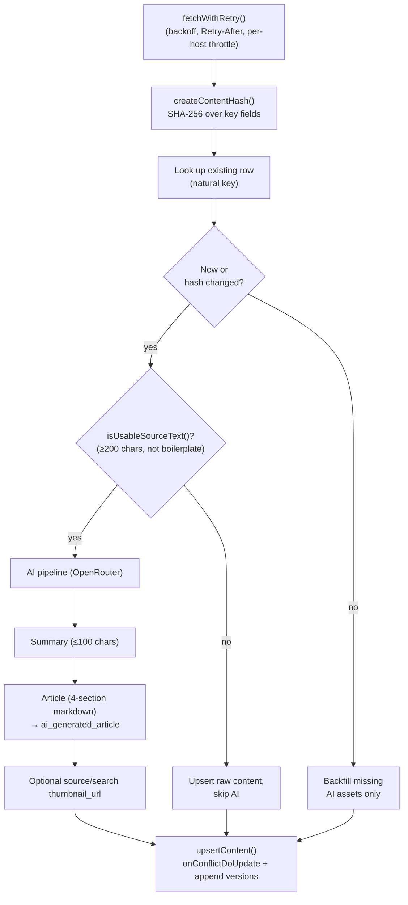

# Scraper Pipeline

## Overview

`apps/scraper/` is a standalone Node.js process. It runs on demand or on a schedule and writes **directly to the database** via `@acme/db` — no HTTP, no tRPC, no auth. It's a trusted server-side process; routing writes through tRPC would add latency, require tokens, and force write endpoints to be secured for no benefit.

Invoke via CLI: `pnpm start [scraper|all] [options]` (`scraper` defaults to
`all`). From the repo root, use
`pnpm --filter @acme/scraper run start [scraper] [options]`. Flags (`apps/scraper/src/main.ts`):

| Flag                  | Default | Meaning                                                                                       |
| --------------------- | ------- | --------------------------------------------------------------------------------------------- |
| `--concurrency`, `-c` | `3`     | Items processed concurrently within each scraper, via `p-limit`.                              |
| `--max-items`, `-n`   | —       | Cap on source records per scraper this run; overrides each scraper's `*_MAX_ITEMS` env value. |
| `--bill`, `-b`        | —       | Fetch specific congress.gov bills by number (repeatable); requires the `congress` scraper.    |
| `--congress`          | `119`   | Congress number for `--bill`; only valid alongside `--bill`.                                  |

`all` runs every registered scraper with `Promise.allSettled` (one failure does
not abort the others) and validates env for the whole set up front; a single
named scraper validates only its own contract and is the only mode that accepts
`--bill`/`--congress`/`targets`. Every run prints its **database target** (a
loud warning when it resolves to production, from `env.ts`) and a metrics
summary at the end.

It ships as a multi-stage `Dockerfile.scraper` (Node 22-slim). Vite builds the
Node ESM production entries, bundles linked workspace source, and leaves
ordinary runtime dependencies external for the production install. The container
starts the CLI with `node dist/main.js`; production configuration is read from
the process environment at runtime, not embedded during the build. Where and how
often it runs in production is covered in the ops memory, not here.

## Scrapers

The registered set lives in `apps/scraper/src/scrapers.ts` — **that array is the
source of truth for what `all` runs**, in this order:

| Scraper                | Source                         | Content type         | Method                                                                                                                          |
| ---------------------- | ------------------------------ | -------------------- | ------------------------------------------------------------------------------------------------------------------------------- |
| `federalregister.ts`   | federalregister.gov REST API   | `government_content` | REST (presidential documents); HTML→Markdown via Turndown                                                                       |
| `congress.ts`          | congress.gov REST API          | `bill`               | REST (`CONGRESS_API_KEY`), incremental by source `updateDate` — see [Incremental discovery](#incremental-discovery-congressgov) |
| `open-states.ts`       | Open States v3 API             | `bill`               | REST (`OPEN_STATES_API_KEY`), incremental by source `updated_at` — see [State bills](#state-bills-open-states)                  |
| `scc-cvig.ts`          | Santa Clara County voter guide | `civic_api_cache`    | PDF extraction; optional Gemini fallback (`GOOGLE_GENERATIVE_AI_API_KEY`)                                                       |
| `ca-sos-statements.ts` | CA Secretary of State guide    | `civic_api_cache`    | official candidate-statement pages, PDF fallback via `ca-sos-vig-pdf.ts`                                                        |

The feed content types (`bill`, `government_content`, and `court_case` from the
unregistered scotus scraper) all write through `upsertContent()` and share the
full AI pipeline below. The two
**civic** scrapers are different in kind: each collapses a whole election's
material into a _single_ `CivicApiCache` row (`insert … onConflictDoUpdate` keyed
on `(addressHash, endpoint, params)`), runs no AI pipeline, and feeds
candidate/ballot enrichment rather than the content feed. See
[candidate enrichment](./candidate-enrichment.md) and
[civic data sources](./civic-data-sources.md).

**Present in the tree but not registered:**

- `scotus.ts` (`court_case`, CourtListener REST) — implemented and runnable by
  name (`pnpm start scotus`) but deliberately kept out of `scrapers.ts`, so `all`
  never runs it. Why it's parked, and what re-enabling needs, is recorded in the
  ingestion memory rather than duplicated here.
- `ca-sos-vig-pdf.ts` — not a scraper. It's the PDF fallback reader
  `ca-sos-statements.ts` imports when the CA SOS candidate HTML pages are blocked
  by Imperva/CloudFront.
- `scrapers/disabled/` — parked cache-warmers kept in-tree for reference but not
  exported or run: `ca-lao-fiscal.ts` (CA LAO proposition fiscal analyses),
  `ca-vig-archive.ts` (historical CA SOS voter-guide archive), `vote411.ts`
  (League of Women Voters guides), and `vote411-ballot.ts` (Playwright
  address-based ballot lookup). Several have live request-time adapters under
  `packages/api/src/lib/measure-sources/` that fall back to fetching on cache
  miss, so the feature still works without the warmer running — see
  [measure enrichment](./measure-enrichment.md).

All HTTP goes through one `fetchWithRetry()` utility (`apps/scraper/src/utils/fetch.ts`): exponential backoff (1s/2s/4s…), `Retry-After` support (seconds or HTTP-date), 30s default timeout via `AbortController`, retriable on 429/5xx and `ECONNRESET`/`ECONNREFUSED`, plus a stateful **per-host backoff** that ramps on 429/5xx and relaxes on success.

> Note: `whitehouse.gov` cheerio scraping was replaced by the structured **Federal Register** REST API.

## Incremental discovery (congress.gov)

Each run walks the congress.gov bill feed forward from a stored cursor. Three
properties matter, and each exists because its absence caused a real outage:

**The cursor is the source's clock, not ours.** `scraper_cursor` holds the
`updateDate` of the newest bill we have _durably written_, keyed
`congress:{congress}`. It used to be `max(Bill.updatedAt)` — the time we last
wrote a row — passed to the API as `fromDateTime`, which filters on
congress.gov's clock. Comparing two unrelated clocks meant every bill a run
fetched but did not persist fell behind the cursor permanently.

**The cursor is a table, not a `max()` over bills.** A targeted `--bill`
backfill of a recent bill would push a derived max() forward and strand every
older bill behind it. Only the feed walk writes the cursor.

**The walk is oldest-first** (`sort=updateDate+asc`). Descending order only
works with an unbounded window; bounded at `maxBills` it takes the newest N and
strands the rest. Ascending drains monotonically — whatever a run does not
reach is the next run's first page. The cursor advances only across the
_leading run of successes_, so the first failure is the high-water mark and
everything after it is simply re-offered.

There is no chamber filter: `/bill/{congress}` does not support one. A
`chamber=house` parameter was sent for years and silently ignored, so the feed
has always carried both chambers; `originChamber` from the detail endpoint is
what labels each row.

An empty cursor means a full walk from the start of the congress, which is how
backfills run — stop and restart freely, the cursor is durable.

`--bill "H.R. 7008"` (repeatable, plus `--congress`) fetches specific bills
directly and bypasses the cursor entirely, for backfilling a single bill or
regenerating one for testing.

## State bills (Open States)

`open-states.ts` ingests state-legislature bills into the same `Bill` table and
the same AI pipeline as federal ones. Browse currently supports California,
North Carolina, and Texas
(`OPEN_STATES_STATES=ca,nc,tx`); each state walks its own cursor keyed
`open-states:{state}`.

**Identity.** A state bill's `billNumber` is `"CA SB 243 (2025-2026)"` and its
`sourceWebsite` is `openstates.org`. All three parts are load-bearing: the
uniqueness constraint is `(billNumber, sourceWebsite)`, SB 243 exists in most
states, and SB 243 exists in _every_ California session as an unrelated bill.
Changing that format silently duplicates every row already stored.
`Bill.congress` stays null for state bills — it is a federal field, and the
session lives in the bill number instead. Chamber is the state's own vocabulary:
California's lower house is the **Assembly**, not the House.

**One request per twenty bills.** The walk asks `/bills` for sponsorships,
abstracts, actions and versions inline rather than fetching each bill's detail
separately. This is a quota decision, not a style one — the free Open States
tier allows a few hundred requests a day, and at one request per bill a
California session would take weeks to drain, which is exactly why the
CourtListener scraper is parked. Bill _text_ is fetched from the state's own
site (leginfo for CA), so it does not draw on the API budget at all.

Everything else matches the federal walk: ascending `updated_since` from a
durable cursor, retry queue, and the same three-way `upsertContent` outcome
contract. `updated_since` is date-granular, so the cursor rounds _back_ to its
own day — an unchanged bill re-offered is a no-op upsert, whereas rounding
forward would drop everything updated later that day.

`--recent 100` is the production freshness mode. It re-reads the 100 most
recently updated measures in each selected state without touching the ascending
backfill cursor. The supervisor runs this mode daily and isolates each supported
state in its own job, so one state's source failure cannot block the others.

`--bill "SB 243"` (with optional `--session 20252026`) fetches specific bills and
bypasses the cursor, the same way `--bill` does for congress.gov.

### Bulk backfill

`--bulk-dir <path>` imports an unzipped Open States session-CSV export through
the same normalization and upsert path as the API, with no API requests at all.
It is the fast way to seed a session before letting the incremental walk take
over.

It takes a local directory rather than downloading, because the archives at
<https://open.pluralpolicy.com/data/session-csv/> sit behind a **site login**,
not the API key — an unauthenticated fetch gets "Please log in to access download
links". Automating it would mean storing account credentials in the scraper. So:
sign in, download the session archive, unzip it, and point `--bulk-dir` at the
directory.

```sh
pnpm --filter @acme/scraper run start open-states --bulk-dir ~/Downloads/CA_2025-2026_csv --session 20252026
```

The import deliberately does **not** move the cursor. An export is a snapshot of
a whole session with no position in the update feed, so there is no high-water
mark to take from it, and writing one would strand every bill changed since the
export was built.

Open States documents the CSV format as experimental. The reader maps columns by
name with a few aliases and raises `BulkExportShapeError` listing the columns it
actually found if the shape has moved — it will not quietly import shifted data.
Pass `--session` for exports that omit a session column; it becomes part of each
bill's stable identity.

**Not ingested:** roll-call votes. `Bill` has no column for them and inventing
one is out of scope here; the `openStates` tRPC router already serves votes
live for the bill detail screen.

## Bill text: which version, and how much

`fetchFullText` stores the **operative** text — the most recent version by
date, which for a passed bill is the engrossed text, not what was introduced.
The API returns versions newest-first; a `.reverse()` here once assumed the
opposite and stored every bill's introduced draft. H.R. 7008 passed the House
with a substitute adding a photo-ID voting section, and none of it was in our
copy.

Text is stored **whole or not at all**. `Bill.searchVector` is a generated
column running `to_tsvector` over `full_text`, and Postgres rejects input over
1,048,575 bytes, so an enormous bill cannot be stored complete. Rather than
truncate, `fetchFullText` raises `BillTextTooLargeError` and the bill is
skipped: a truncated bill is not a smaller bill, it is a wrong one that reads
as complete. An earlier 1,000-word cap cut H.R. 7008 mid-section and the
generated brief then told readers the bill specified no penalties. The walk
treats the refusal as a deliberate skip rather than a retryable failure so one
giant bill cannot wedge the cursor. Section-aware storage is the real fix
(issue #191).

## Upsert + Change Detection

`apps/scraper/src/utils/db/operations.ts` centralizes writes behind a discriminated-union `upsertContent(type, data)` (`type` ∈ bill | government_content | court_case). Each run:

1. Compute a SHA-256 over the type-specific key fields (title, summary, full text, status…).
2. Look up the existing row by its natural key (`(billNumber, sourceWebsite)`, `url`, or `caseNumber`).
3. **Unchanged hash** → skip AI entirely; backfill only missing AI assets.
4. **New bill without a source description** → generate the required description first; skip the bill entirely if there is no summary source at all.
5. **New or changed** → run the remaining AI pipeline, upsert via `onConflictDoUpdate`, append to `versions`.

### Complete or not at all

`upsertContent` returns one of three outcomes, and the difference between them
is the whole contract with the cursor:

| Outcome    | Meaning                                                      | Cursor    |
| ---------- | ------------------------------------------------------------ | --------- |
| `written`  | Stored, and as complete as its sources allow                 | advances  |
| `skipped`  | Deliberately not stored; a retry reaches the same conclusion | advances  |
| `deferred` | Not finished, for a reason a later run can fix               | **holds** |

A bill lands complete or it does not land. If enrichment throws — rate limit,
provider error, an article that comes back empty — a bill we had never stored
before is **deleted again** before returning `deferred`. The derived tables
(`content_lens`, `content_brief`, `video`) hold plain uuids rather than foreign
keys, so nothing cascades and the rollback clears each one by hand.

### The retry queue

A single monotonic cursor forces a false choice: advance past a bill we could
not finish and never see it again, or hold the cursor on it and stall every
bill behind one bad item. `scraper_retry` is the third option.

A `deferred` bill is written to `scraper_retry` — keyed
`(scraper_key, item_key)`, where `item_key` is `"{billType}/{billNumber}"` —
and the cursor then moves past it. Each run drains what is due **after**
walking the feed, so a queue that has built up cannot push this week's
legislation behind last month's problem cases. The drain is capped at
`max(10, maxBills / 4)` for the same reason, and retried bills deliberately do
not feed the cursor: they sit behind it by definition, so their timestamps
could only drag it backwards.

Backoff doubles from 15 minutes and caps at a day, so a permanently broken bill
costs one attempt a day rather than one per run forever. Nothing is ever
dropped from the queue — dropping is the silent skip this table exists to
replace — but past 12 attempts the log escalates to an error. **Queue depth is
the health signal to watch:** rows are deleted the moment a bill lands, so a
non-empty table is a live to-do list.

The one thing that still holds the cursor is failing to _record_ the retry. An
unrecorded failure is a lost bill, and re-offering the whole page next run is
the cheap way to not lose it.

Two conditions bypass the queue entirely, because a retry would reach the same
answer: a bill congress.gov has published neither text nor a CRS summary for
(any later change moves its `updateDate` and puts it back in the feed), and a
bill too large to store whole.

### The new-item budget

`SCRAPER_MAX_NEW_ITEMS_PER_RUN` (default 10) caps how many items pay for AI
generation in one run. An item past the cap that we have never stored is
**not stored at all** and reported as `deferred`; one already in the database
gets its raw fields refreshed, skips the derived assets, and is still reported
`deferred` so the cursor waits for them.

The cap counts **items that generate**, not new items, and each item draws at
most one slot however many assets it produces. A slot is claimed at the point
of generation, after each asset's own cache check, so a fully cached item costs
nothing and does not consume budget. Gating on "new" instead left the expensive
case uncapped: an existing bill whose content changed regenerated its brief and
its dual lens with no limit, which meant a backfill correcting stored text
ignored the budget almost entirely.

Note what the budget now costs: a capped run walks only as far as it can
finish. That is deliberate. The earlier design persisted past-budget bills raw
so the cursor could keep moving, on the theory that the retroactive scripts
would fill them in — but a raw row is a bill with no description, article, lens
or brief in front of readers, and nothing guaranteed the backfill ever ran. Set
the budget high (or unset it) for a backfill; the low default is a guard for
the weekly run, not a throughput knob.

Every derived asset must be gated on the budget for the cap to mean anything —
the dual lens in particular runs an agentic research loop. The article/summary/
image block, the lens, the brief, and video generation all claim through the
same per-item function.

`SCRAPER_FORCE_AI_REGEN=1` overrides the cache. An `isUsableSourceText()` gate
(`apps/scraper/src/utils/reprocessing-policy.ts`) refuses to feed AI any text
under 200 chars or that's mostly blank/all-caps/single-word lines — keeps the
model from "summarizing" garbage. Legislative headers (`SEC.`, `TITLE`,
`ARTICLE`…) are exempted so an all-caps bill heading doesn't get counted as
boilerplate. A companion `isUsableAIArticle()` checks a generated article is
≥500 chars and carries all four required section headings; both gates are shared
by the scrape path and the retroactive scripts.

## AI Pipeline

Provider config lives in `apps/scraper/src/utils/ai/provider.ts`: text uses **OpenRouter** first, then an OpenAI-compatible local endpoint (`LOCAL_LLM_BASE_URL`, such as Ollama), with direct DeepSeek retained only as a deprecated last resort. PDF vision fallback uses **Gemini `gemini-2.5-flash`**. Images use hosted **Black Forest Labs FLUX.2 Klein 9B**, then `LOCAL_FLUX_BASE_URL` as a local fallback. Provider usage and hosted-image costs are tracked per run.

Each new/changed item runs through:

1. **Summary** (`text-generation.ts`) — ≤100-char punchy summary, 8th-grade reading level.
2. **Article** (`text-generation.ts`) — structured 4-section markdown: _What This Means For You_, _Overview_, _Impact & Implications_, _The Debate_; balanced across perspectives. Stored in `ai_generated_article`. Throws a typed `AIRateLimitError` on 429.
3. **Brief** (`bill-brief.ts`, bills only) — the structured document that replaces the markdown wall of text in the app: hook, stat tiles, before/after changes, affected groups, unknowns, glossary, optional prose. Quotes are verified verbatim against the source and stripped if they don't match; loaded political phrasing in the model's own voice triggers one regeneration. The brief also receives the official CRS summary as authoritative,
   explicitly non-quotable context, so provisions past its source window are still
   known to it; quotes are verified against the official text alone. Cached in
   `content_brief` by `contentHash`. See [Article generation](./article-generation.md).
4. **Dual lens** (`text-generation.ts`) — proponent/opponent arguments grounded in an agentic web-research loop, cached in `content_lens`. This is the most expensive step and the only one whose output is not reproducible: the same input can return different arguments, and the row is overwritten in place with no history. It is therefore cached on **its own inputs** (title + full text + article type + model version), not on the bill's overall `contentHash` — that hash also covers status and summary, so a routine action update ("Referred to committee" → "Received in the Senate") used to invalidate it and re-roll the dice. One such re-roll lost a finding that H.R. 7008 carried unrelated voter-ID provisions.
5. **Marketing copy** (`marketing-generation.ts`) — Zod-validated `{ title ≤25 chars, description ≤25 words, imagePrompt }` for the `video` feed card.
6. **Imagery** — multiple sources:
   - _Scraped thumbnail_ (preferred, free): source-provided image URL → `thumbnail_url`.
   - _Generated_: hosted FLUX.2 Klein 9B produces a 1024×1024 image, falling back to the configured local FLUX server at 768×768; `sharp` converts PNG→JPEG (q85); bytes land in the `image_data` `bytea` column. Hosted calls retry with backoff; moderation blocks return `null` silently.
   - _Stock-photo fallback_: `image-keywords.ts` → Google Custom Search (`GOOGLE_API_KEY` + `GOOGLE_SEARCH_ENGINE_ID`) can supply a thumbnail URL.

New bills that need an AI description generate it before the initial insert. A
provider outage therefore leaves the source item eligible for the next scrape
instead of persisting an incomplete bill that requires a manual repair.

## Pipeline Flow

The SHA-256 gate is the main cost control: unchanged content skips every AI call.


```mermaid
flowchart TD
    fetch["fetchWithRetry()<br/>(backoff, Retry-After, per-host throttle)"] --> hash["createContentHash()<br/>SHA-256 over key fields"]
    hash --> lookup["Look up existing row<br/>(natural key)"]
    lookup --> changed{"New or<br/>hash changed?"}

    changed -->|no| backfill["Backfill missing<br/>AI assets only"]
    changed -->|yes| usable{"isUsableSourceText()?<br/>(≥200 chars, not boilerplate)"}
    usable -->|no| skipai["Upsert raw content,<br/>skip AI"]
    usable -->|yes| ai["AI pipeline (OpenRouter)"]

    ai --> summary["Summary (≤100 chars)"]
    summary --> article["Article (4-section markdown)<br/>→ ai_generated_article"]
    article --> thumburl["Optional source/search thumbnail_url"]
    thumburl --> upsert["upsertContent()<br/>onConflictDoUpdate + append versions"]
    skipai --> upsert
    backfill --> upsert
```

## Environment & provider-fallback contract

Each scraper declares its env requirements as a typed `ScraperEnvContract`
(`*.config.ts`), and `validateScraperEnv()` (`env.ts`) checks only the scrapers
that will actually run before any work starts — so a missing key fails fast and
loud instead of mid-run. The contract has four tiers:

- **`required`** — hard failure if absent (`POSTGRES_URL` everywhere;
  `CONGRESS_API_KEY` for congress).
- **`requiredAny`** — at least one of a group must be set. The text-AI group is
  `[OPENROUTER_API_KEY, LOCAL_LLM_BASE_URL, DEEPSEEK_API_KEY]`: OpenRouter is
  preferred, the local endpoint is the offline fallback, and DeepSeek is the
  deprecated last resort. The civic scrapers omit this group entirely (no AI).
- **`recommended`** — warn but proceed (e.g. `COURTLISTENER_API_KEY` for scotus).
- **`optional`** — image/stock/model overrides and the per-scraper item caps.

**Per-scraper item caps.** Each content scraper reads its own
`*_MAX_ITEMS` (`CONGRESS_MAX_ITEMS`, `FEDERALREGISTER_MAX_ITEMS`,
`SCOTUS_MAX_ITEMS`, `SCC_CVIG_MAX_ITEMS`, `CA_SOS_MAX_ITEMS`) which bounds how
many source records that scraper pulls per run. The `--max-items` flag overrides
all of them for one run. This is distinct from `SCRAPER_MAX_NEW_ITEMS_PER_RUN`,
which caps how many fetched items may _pay for AI_ (see
[The new-item budget](#the-new-item-budget)).

## Maintenance, backfill & reprocessing scripts

The scrape path persists every fetched item but only lets
`SCRAPER_MAX_NEW_ITEMS_PER_RUN` of them generate AI assets; the rest carry raw
content and are completed later by these standalone entry points. This section
also includes the manual retention command. All are `pnpm`-scripted in
`apps/scraper` and share the pipeline's database safety conventions.

| Command                      | File                            | What it fills                               | Safety                                                        |
| ---------------------------- | ------------------------------- | ------------------------------------------- | ------------------------------------------------------------- |
| `reprocess-content`          | `reprocess-content.ts`          | Any derived asset across all content tables | **Read-only by default**; needs `--apply` (+ `--yes` on prod) |
| `retroactive-briefs`         | `retroactive-briefs.ts`         | Missing/stale bill `content_brief` rows     | `--dry-run` to preview                                        |
| `retroactive-lenses`         | `retroactive-lenses.ts`         | Missing/stale `content_lens` rows           | `--dry-run` to preview                                        |
| `backfill-bill-descriptions` | `backfill-bill-descriptions.ts` | Bills with no source/AI description         | `--apply` (+ `--yes` on prod)                                 |
| `prune-bills`                | `prune-bills.ts`                | Bills beyond the newest N per jurisdiction  | **Read-only by default**; needs `--apply` (+ `--yes` on prod) |

The scheduled Congress refresh passes `--recent 80 --retain 80`; Open States
refreshes pass `--recent 100 --retain 100`. After a successful `--recent` run,
PostgreSQL ranks and deletes overflow for only the refreshed jurisdiction,
returning aggregate counts rather than bill rows. The standalone command is for
manual inventory and repair, not routine scheduling.

`reprocess-content` is the most general and the model the others follow:

- **Read-only unless `--apply`.** It first prints an inventory per content type
  (rows, usable source text, missing article or brief, selected) and
  exits without writing. Production writes additionally require `--yes`, and
  `--apply` refuses to start without a text-AI provider and an image provider so
  a run can't silently leave rows half-generated.
- **`--mode missing`** backfills only rows that fail a gate (`needsReprocessing`:
  no usable source text, no valid article, or no structured bill brief);
  **`--mode replace`** (the default) regenerates every derived asset.
- **`--assets images`** limits work to source/search thumbnails;
  `--assets all` (default) also regenerates long-form text and dual lenses.
- Selection can be scoped with `--type`, `--limit`, `--id`, and `--after-id`
  (resume-after-UUID, single-type only), at `--concurrency` 1–5.
- **Missing source text is re-fetched, not skipped.** When a row's `full_text`
  is empty/unusable, `refreshSourceText()` (`utils/source-refresh.ts`) re-pulls
  it from the origin — congress.gov text API for bills, the Federal Register
  `body_html_url` for government content, otherwise a readability-style HTML
  strip → Markdown — and only proceeds if the recovered text passes
  `isUsableSourceText()`. Recovered text gets a fresh content hash so downstream
  assets regenerate against it.
- **Success is re-queried from the database**, not inferred from provider
  responses: after the run it reloads the processed rows and counts only those
  that persisted a valid article or structured bill brief. Partial/failed
  IDs are printed for a targeted retry, and rate-limit failures re-raise
  `AIRateLimitError` so an orchestrator can back off.
